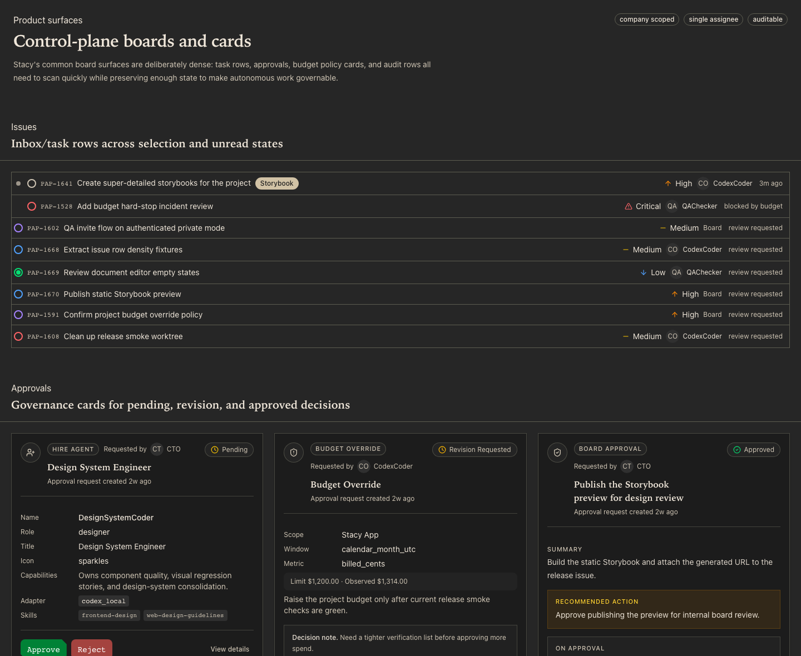

<p align="center">
  <picture>
    <source media="(prefers-color-scheme: dark)" srcset="docs/images/logo-dark.svg">
    
  </picture>
</p>

<h1 align="center">Stacy</h1>

<p align="center">
  <strong>A trust-first control plane for assigning, supervising, and auditing local AI agents.</strong>
</p>

<p align="center">
  <a href="https://www.npmjs.com/package/stacy-cli"></a>
  <a href="https://github.com/StacyOS/stacy-cli/releases"></a>
  <a href="LICENSE"></a>
  
</p>

Stacy gives operators a local cockpit for running Codex, Claude, and other CLI
agents with visible ownership, live logs, budgets, approvals, workspace
isolation, and stop controls. It is built for the moment when a chat window is
not enough and you need to know: who is working, what changed, what it cost,
what is risky, and how to stop it.



## Quick Start

Run Stacy from npm:

```bash
npx stacy-cli@latest onboard --yes
npx stacy-cli@latest run
```

Open [http://localhost:3100](http://localhost:3100).

The npm package is `stacy-cli`; it exposes the `stacy` command when installed.
Inside a cloned repository, use the workspace shortcut:

```bash
pnpm stacy onboard --yes
pnpm stacy run
```

Prerequisites:

- Node.js 20 or newer
- A local Codex, Claude, or other supported CLI login for the agents you want
  to run
- pnpm 9 or newer for repository development

Stacy does not ship shared Codex or Claude credentials. Each operator connects
their own local account on their own machine.

## Why Stacy

AI agents are useful, but they become hard to trust when their work is invisible.
Stacy turns autonomous work into an auditable operating surface:

- every agent has an owner, role, budget, permissions, and adapter config
- every task has status, assignment, run history, logs, and review state
- every run can be watched, inspected, retried, cancelled, or killed
- every risky action can be put behind an approval gate
- every workspace can be isolated with a git worktree

The product should feel like an agent operations cockpit: part project board,
part runtime console, part audit log.

## What You Get

| Area | What Stacy provides |
| --- | --- |
| Agent operations | Create Codex, Claude, Cursor, Gemini, OpenCode, Pi, and gateway-backed agents with roles and permissions. |
| Task execution | Assign issues to agents, track run state, inspect transcripts, and cancel work in progress. |
| Trust controls | Approval gates, stop controls, budget limits, cost visibility, and risk surfaces. |
| Local-first runtime | User-owned local CLI credentials, local API/UI, embedded Postgres, and Docker/self-hosting paths. |
| Workspace safety | Git worktree isolation per task, workspace lifecycle tracking, and recovery for stalled work. |
| Auditability | Run timelines, logs, cost records, comments, approvals, and activity history. |
| Operations | Backup, restore, upgrade checks, release smoke tests, and self-hosted operations docs. |

## Core Workflow

1. Create a company.
2. Connect a project or workspace.
3. Connect the user's local Codex or Claude account.
4. Add an agent with role, model, budget, and permissions.
5. Create or import a task.
6. Assign the task to an agent.
7. Watch the live run, logs, cost, and risk state.
8. Cancel, approve, review, or mark the task done.

## How It Works

```text
Stacy CLI / Web UI
        |
Local API + Auth
        |
Postgres domain model
        |
Outbox + run queue
        |
Run orchestrator
        |
Workspace / environment lease
        |
Agent adapter
        |
Codex / Claude / Cursor / Gemini / OpenCode / Pi
```

Stacy keeps the control plane separate from the agent runtime. The control plane
stores durable task, run, cost, approval, and log records. Adapters translate
Stacy assignments into CLI execution for the user's own local agent accounts.

## Comparison

This is a practical positioning map, not a scoreboard. Stacy is focused on
trustworthy local agent execution rather than chat-only collaboration or fully
managed cloud workers.

| Capability | Stacy | Multi-agent chat tools | Cloud agent platforms | CI automation | Project-management tools |
| --- | --- | --- | --- | --- | --- |
| Local-first operation | Yes | Sometimes | Usually no | Sometimes | N/A |
| User-owned Codex/Claude CLI login | Yes | Rarely | Usually no | N/A | N/A |
| Live agent run logs | Yes | Limited | Yes | Yes | No |
| Human approval gates | Yes | Sometimes | Sometimes | Yes | Manual only |
| Cost and risk surface | Yes | Limited | Varies | Limited | No |
| Git worktree isolation | Yes | Rarely | Varies | Usually repo checkout based | No |
| Kill switch / cancel controls | Yes | Limited | Varies | Yes | No |
| Task ownership and review state | Yes | Limited | Varies | No | Yes |
| Self-hosting path | Yes | Varies | Varies | Yes | Varies |

## Supported Agent Adapters

Stacy is designed around adapter contracts. The current local adapter family
includes:

- Codex local
- Claude local
- Cursor local
- Gemini local
- OpenCode local
- Pi local
- OpenClaw gateway

Adapters use the user's local environment. If a CLI needs authentication, the
user signs in with that provider's own login flow before assigning work.

## Trust And Safety Model

Stacy's first product promise is not maximum autonomy. It is dependable
autonomy that operators can understand and interrupt.

- **Credential boundary:** Stacy does not bundle shared model-provider
  credentials.
- **Workspace boundary:** agent work can run in isolated git worktrees.
- **Approval boundary:** risky steps can require explicit human approval.
- **Cost boundary:** agent, task, project, and run costs are visible.
- **Secret boundary:** secrets are scoped and redacted from logs where possible.
- **Operational boundary:** live runs can be cancelled and failed runs remain
  inspectable.

## Local Development

Install dependencies and start the app:

```bash
pnpm install
pnpm dev
```

Useful commands:

```bash
pnpm stacy onboard --yes
pnpm stacy doctor --repair --yes
pnpm stacy db:backup
pnpm stacy upgrade:check
pnpm test:run
pnpm typecheck
```

Release and public-package checks:

```bash
pnpm smoke:stacy-cli-npm -- --version <published-version> --expected-core <published-version>
pnpm release:phase5-gate -- --strict-live
```

## Federation Demo

Stacy ships with an executable two-install federation demo that proves the
protocol layer end-to-end: a signed Knowledge Object created on Install A,
federated to Install B under per-object consent, read with cryptographic
verification, revoked on A, then denied on B's next read — with a
hash-chained receipt trail on both sides and a signed verification report
attesting to what B actually checked. Every gate is reproducible in under
thirty seconds on a freshly cloned repo.

**Run the protocol gate (~60-90 s):**

```bash
pnpm install
pnpm --filter @arpanstacy/stacy-federation demo:check
```

Expected: preflight ✓, typecheck ✓, **7 acceptance tests**, **4 real DB
smoke tests** against embedded Postgres, **4 real two-install server smoke
tests** with real child processes and HTTP.

**Run the public demo storyboard (~25 s):**

```bash
pnpm --filter @arpanstacy/stacy-federation demo:public
```

This runs the literal flow: contact-card exchange → `stacy run` with the
shipped CSV → `stacy share --with-contact` → federated read → `stacy revoke`
→ denied next read → receipt chain verification on both installs.

**Run the 3-of-3 repeat gate before any presentation:**

```bash
STACY_FEDERATION_PUBLIC_DEMO_REPEAT=3 pnpm --filter @arpanstacy/stacy-federation demo:public:repeat
```

Latest local result: 3/3 passed, slowest run 29.09 s.

**See the React UI on your machine:** the federation brain page at
`/federation/brain/:koId` renders any signed KO with its provenance, consent
status, signature verification, receipt chain validity, and any signed
verification reports attached to it. The full walkthrough — three real
screenshots, copy-paste reproducer steps, and the keep-alive script that
seeds a live two-install demo — lives in
**[docs/stacy/FEDERATION-DEMO.md](docs/stacy/FEDERATION-DEMO.md)**.

What the demo proves:

- **Identity is keypair-anchored**, not registry-anchored — Ed25519 install
  identities with `installId = "install_" + sha256(publicKeyPem)[0..32]`.
- **Consent is per-object** — signed grants bind one producer, one consumer,
  one KO content hash, one scope, one expiry.
- **Revocation is consumer-pulled** — the producer hosts an endpoint; the
  consumer queries it at read time. No push, no fan-out.
- **Audit is tamper-evident** — per-KO hash chain catches in-flight edits;
  instance-level anchor chain catches wholesale deletions.
- **Transport is hardened** — every federation message carries a signed
  nonce and timestamp; replays inside a 60-second window are rejected
  against a Postgres-backed nonce log; production endpoints require HTTPS.
- **Verification reports** — consumers issue signed attestations of what
  they verified about a KO (signature, content-shape contract, CSV
  reconciliation, deterministic reconstruction), persisted as Knowledge
  Objects in their own right.

## Documentation

- [Quickstart](docs/start/quickstart.md)
- [What is Stacy?](docs/start/what-is-stacy.md)
- [Architecture](docs/stacy/ARCHITECTURE.md)
- [Federation demo walkthrough](docs/stacy/FEDERATION-DEMO.md)
- [Self-hosted operations](docs/stacy/SELF-HOSTED-OPERATIONS.md)
- [Public CLI packaging](docs/stacy/PUBLIC-CLI-PACKAGING.md)
- [Phase 5 release notes](docs/stacy/PHASE-5.md)
- [Releases](https://github.com/StacyOS/stacy-cli/releases)

## Repository Status

The public npm entrypoint is:

```bash
npx stacy-cli@latest onboard --yes
```

The exact `npx stacy onboard` package name is not the supported public path
because the `stacy` package name is not available on npm.

## Maintainer

Stacy is maintained by [Arpan Mondal](https://github.com/arpan-mondal).

## License

Stacy is released under the MIT license. See [LICENSE](LICENSE).
