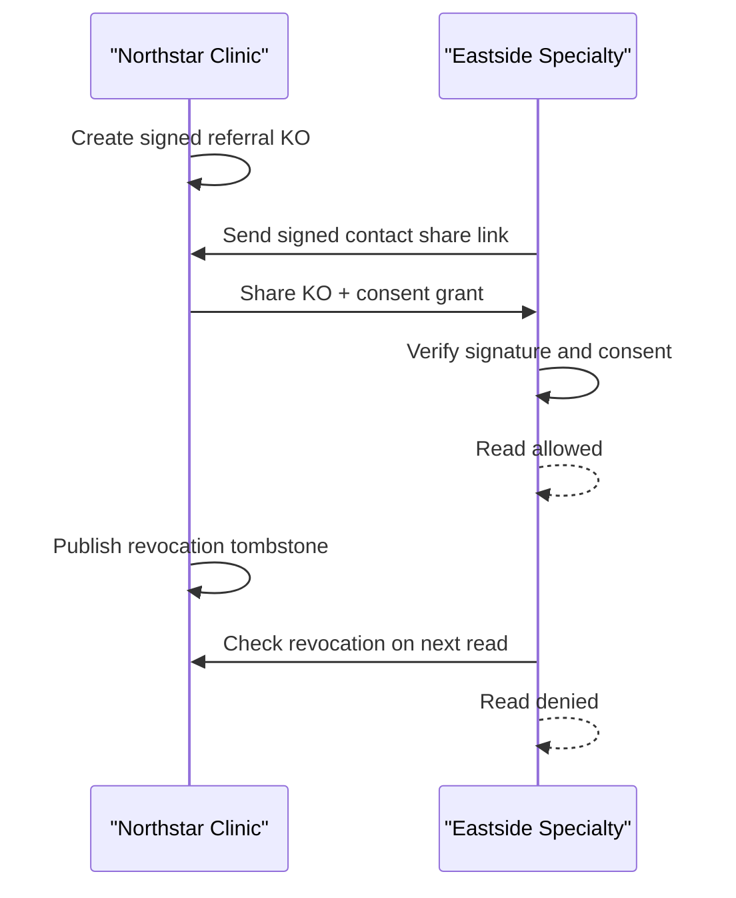

# Federation Demo Conceptual Guide

## The Story

Northstar Clinic sends a signed referral packet to Dr. Meera Patel at Eastside
Specialty. Eastside can read it only while consent is valid. When the patient
withdraws consent, Northstar revokes access, and Eastside's next read is denied
by Eastside's own Stacy install.

## The Protocol Loop

## What Is Proved

- The artifact is signed by the producer install.
- The content hash binds the KO to the input file.
- The consumer needs a per-object consent grant.
- Revocation is enforced at read time.
- Receipts record create, share, receive, read, revoke, and deny events.
- Receipt chains make audit tampering visible.

## What Is Not Claimed Yet

- No directory service; peers exchange signed share links out of band.
- No write/admin workflow in the public demo path.
- No multi-party witness layer for revocation.
- No production UI for every protocol primitive.
