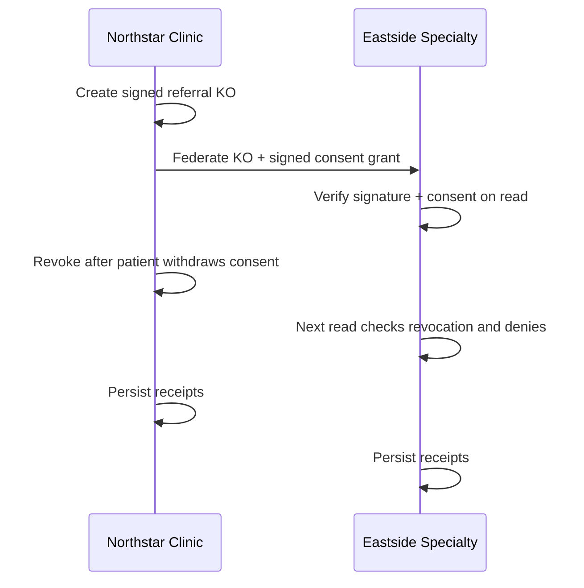

# Federation Investor Assets

This document is the Phase 1G packaging checklist for the healthcare referral
demo.

## Video

Canonical video length: 90 seconds.

Scene order:

1. Problem: referral context leaves Northstar without durable consent.
2. Create: Northstar signs `ko_referral_packet`.
3. Share: Northstar grants Eastside per-object read consent.
4. Read: Dr. Meera Patel sees the packet with provenance.
5. Revoke: patient withdraws consent.
6. Deny: B's page flips from `Read allowed` to `Read denied` without refresh.
7. Audit: receipts verify on both installs.
8. Claim: signed context, owned consent, local enforcement.

Video acceptance:

- no silent screen capture; use voiceover or captions
- no cuts during a trust claim
- show the SSE live transition
- show receipt verification
- end with the one-sentence pitch from `docs/federation-demo-script.md`

## Landing Page

Target URL: `https://stacy.dev/demo`

Above the fold:

- headline: `Signed context for organizations and AI systems`
- one-sentence healthcare referral scenario
- embedded 90-second video
- `Try the live demo` CTA -> consumer KO page
- `Read the technical walkthrough` CTA -> deep dive

Below the fold:

- how the protocol works
- five primitives: signed KO, consent grant, contact card, revocation tombstone,
  receipts
- verification numbers from latest gate
- honest limitations
- email capture
- changelog link

## Investor Deck

Ten slides maximum:

1. Problem
2. Today's broken workflow
3. StacyOS claim
4. Watch the demo
5. Five primitives
6. Why N=2 proves the protocol
7. Market / wedge
8. Why now
9. What is not solved yet
10. Ask

Each slide should answer exactly one question. Do not pre-announce roadmap
protocols as shipped.

## Technical Diagram

Use this flow everywhere:

## README Entry Point

The public README should link to:

- `docs/federation-scenario.md`
- `docs/federation-demo-script.md`
- `docs/federation-live-deployment.md`
- `packages/federation/DEMO_RUNBOOK.md`

## Honest Limitations

Use this copy:

This is not production healthcare infrastructure. The data is synthetic, the
deployment is an N=2 demo, and enterprise workflows like group consent, key
rotation, witnessed revocation, external audit, and full clinical compliance
remain roadmap items.

## Gate

Phase 1G is complete when the video, landing page, deck, and README all use the
same healthcare referral scenario and every public claim corresponds to a
passing demo gate or an explicitly marked limitation.
