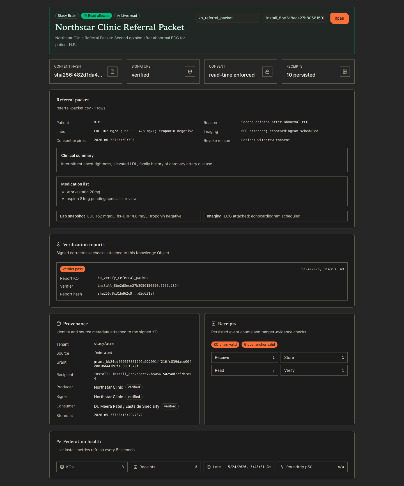
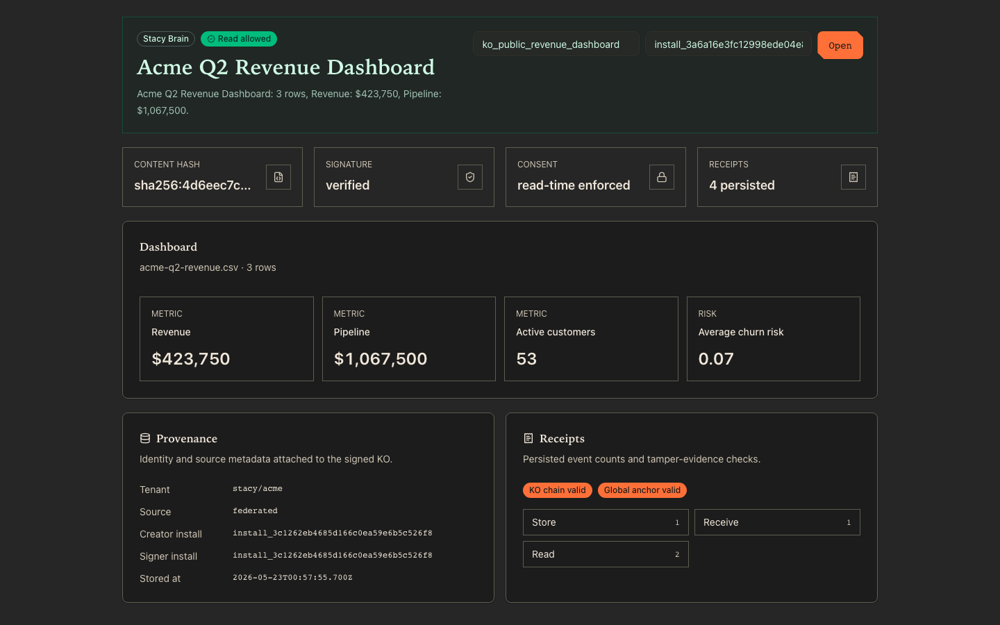

# StacyOS Federation Demo — Complete Report

> **The definitive single document.** Every claim, every command, every gap. If you're reading this and have time for only one demo artifact, this is the one.

---

## 0. Document metadata

| Field | Value |
|---|---|
| **Last updated** | 2026-05-23 |
| **Repo** | https://github.com/StacyOS/stacy-cli |
| **Active branch under test** | [`federation-demo-polish-final`](https://github.com/StacyOS/stacy-cli/tree/federation-demo-polish-final) |
| **Base for review** | `federation-demo-product-readiness-qv` |
| **Open pull request** | [#2 — Phase 3G land + polish + live-LLM adapter + tooltip + real-API fixture](https://github.com/StacyOS/stacy-cli/pull/2) |
| **Release notes draft** | [`releases/v2026.524.0.md`](https://github.com/StacyOS/stacy-cli/blob/federation-demo-polish-final/releases/v2026.524.0.md) |
| **PR diff stat** | 102 files, +11,152 / −178 |
| **Verification commit** | `97c2962b phase-polish/release-notes: v2026.524.0 release notes for the polish PR` |
| **Last full gate run** | All green: `demo:check` ✓, `demo:public` ✓ in 20-25 s, `demo:public:adapter-cached` ✓ in 28.23 s, `demo:public:repeat 3×` ✓ slowest 25.47 s |

---

## 1. The 30-second pitch

A *Knowledge Object* is a signed, content-addressed JSON capsule. Two Stacy installs — one acting as the producer (Northstar Clinic), one as the consumer (Dr. Meera Patel at Eastside Specialty) — exchange a healthcare referral packet under a per-object consent grant. The consumer reads it, the producer revokes it, the consumer's next read fails — with a tamper-evident receipt trail on both sides and a signed verification report attesting to what was checked. End-to-end in ~25 seconds, reproducible 3 out of 3 runs, on a freshly cloned repo. **The protocol works. The unit test of federation is N=2 installs. The product is 10, then 100, then 10,000 — same protocol at every scale.**

---

## 2. What this demo proves / does not prove

### Proves (verified)

1. **Identity is keypair-anchored, not registry-anchored.** Ed25519 install identities derived as `installId = "install_" + sha256(publicKeyPem)[0..32]`. No central authority.
2. **Knowledge Objects are content-addressed and tamper-evident.** Canonical JSON + SHA-256 content hash + Ed25519 signature. Tampering with any field — content, tenant, hash, signer, or signature — falsifies verification.
3. **Consent is per-object, not per-role.** A signed grant binds *one* producer, *one* consumer, *one* KO content hash, *one* scope (read or write), *one* expiry.
4. **Revocation is consumer-pulled, not producer-pushed.** Producer hosts a revocation endpoint; consumer queries it at read time. No fan-out, no eventual consistency.
5. **Audit is tamper-evident in two layers.** Per-KO hash chain catches in-flight edits; instance-level anchor chain catches wholesale deletions across KOs.
6. **Transport is hardened.** Every federation message carries a signed nonce + signed `createdAt`. Replays inside 60 s are rejected against a Postgres-backed nonce log. Non-loopback endpoints must use HTTPS.
7. **The adapter trust boundary is explicit.** `--ack-egress` is mandatory before any LLM call. Optional `STACY_PUBLIC_DEMO_ALLOWED_ADAPTERS` allowlist. 60-second hard kill timeout. JSON output validated against `AdapterReferralPacketOutput` contract before KO creation.
8. **Consumers can issue signed verification reports.** New KO content type `verification_report` carries cryptographic + structural checks (signature, content-shape contract, source-input reconciliation, deterministic reconstruction). Verdict is `pass` or `fail`.

### Does not prove

- **That an LLM produces correct dashboards.** The default generator is deterministic; the adapter path exists for experimentation, gated behind explicit operator consent.
- **That this scales to 10⁴ installs.** The *protocol* composes pairwise and is structurally `O(1)` per message. Discovery, certificate distribution, and operational ergonomics at scale are deployment problems, not protocol problems.
- **That a malicious producer cannot withhold revocation tombstones.** The trust model assumes the producer is honest about its own revocations. Byzantine-fault-tolerant federation is explicitly out of scope at N=2.
- **That cross-host federation works.** Both installs in the demo run on `127.0.0.1` with different ports. The transport policy *accepts* HTTPS; a real two-machine deployment is operator runbook territory.

---

## 3. Visual tour

Each screenshot is a real capture of the live UI running against a seeded two-install harness on a developer machine.

### Screen 1 — Federated read, allowed (with verification report)



What to look for:

- **Top header (green tint).** `Stacy Brain` chip + `Read allowed` badge = the federation read path completed cleanly: signature verified, content hash matched, consent grant covered the KO, no revocation tombstone applied.
- **Four proof tiles.** Content hash, signature status (`verified`), consent (`read-time enforced` because B is reading a federated KO from A), receipt count.
- **The referral packet body.** Patient reference, referral reason, clinical summary, lab snapshot, medications, imaging status — rendered from the signed KO content.
- **Verification reports panel.** B's signed attestation about what they verified. Shows verdict, the verification KO id, the verifier install id, the report content hash. If any check failed or warned, those IDs would show as hover-tooltip chips.
- **Provenance panel.** Tenant `stacy/acme`, source `federated`, producer install id, signer install id, stored-at timestamp.
- **Receipts panel.** Two green badges confirm both tamper-evidence chains are intact. Below: every receipt event type with a count.
- **Federation health card.** Live counters: KOs, receipts total, roundtrip p50, last receipt timestamp. Auto-refreshes every 5 seconds.

### Screen 2 — Federated read, denied (after revoke)


Same React component, different data:

- **Red `Read denied` badge** in the header.
- **Reason text:** the exact string returned by the read-time enforcement predicate — `Consent grant has been revoked`.
- **No content body rendered.** Not even fetched from the database.
- **Same tamper-evidence chains pass.** The revocation didn't tamper with anything; it appended a tombstone and the consumer chose to honor it.
- **Receipts panel includes `Deny: 2`.** Every denied read produces a `deny` receipt.

### Screen 3 — Producer-side local view


The same KO id from Screen 1, viewed on Install A (the producer):

- **Consent tile reads `local owner`** — no grant in play; the install owns the KO outright.
- **Provenance source reads `local`** instead of `federated`.
- **Receipts are different:** `Sign 1, Create 1, Share 1` — the producer-side events. The consumer side had `Receive, Store, Read`. The protocol records both halves of every exchange independently.

### Screen 4 — Original allowed view (pre-verification-primitive)



The earliest captured allowed-state, kept for historical reference. Shows the dashboard widget render path (revenue, pipeline, active customers, churn risk) before the demo scenario was rewritten to use the healthcare referral packet.

---

## 4. Architecture

### Two-install diagram

```
┌──────────────── Install A — Northstar Clinic (producer) ──────────────┐         ┌──────────────── Install B — Eastside Specialty (consumer) ──────────┐
│                                                                        │         │                                                                       │
│   ┌──────────────┐   ┌──────────────────────────────────────┐         │         │   ┌──────────────────────────────────────┐   ┌──────────────┐         │
│   │ Stacy CLI    │ → │ packages/federation                  │         │         │   │ packages/federation                  │ ← │ Stacy CLI    │         │
│   │ + UI         │   │  • identity (Ed25519)                │         │         │   │  • identity (Ed25519)                │   │ + UI         │         │
│   │ stacy run    │   │  • ko (sign + verify)                │         │         │   │  • ko (verify)                       │   │ stacy brain  │         │
│   │ stacy share  │   │  • consent (grant + tombstone)       │ HTTPS   │         │   │  • consent (enforce)                 │   │   show       │         │
│   │ stacy revoke │   │  • sync (nonce + replay window)      │ POST    │         │   │  • sync (claim nonce)                │   │ stacy brain  │         │
│   │ stacy        │   │  • contacts (signed cards)           │ /api/   │         │   │  • contacts (verify cards)           │   │   verify     │         │
│   │   contacts   │   │  • receipts (per-KO chain + anchor)  │ federa- │         │   │  • receipts (per-KO chain + anchor)  │   │              │         │
│   │ stacy        │   │  • identity (key rotation)           │ tion    │         │   │  • verification (signed reports)     │   │ stacy        │         │
│   │   identity   │   │  • adapter seam (Claude/fake/cache)  │         │         │   │  • dashboard (referral_packet)       │   │   receipts   │         │
│   │ stacy        │   │  • dashboard (referral_packet)       │         │ HTTPS   │   └─────────────┬────────────────────────┘   └──────────────┘         │
│   │   receipts   │   └─────────────┬────────────────────────┘         │ GET     │                 │                                                       │
│   └──────────────┘                 │                                   │ /api/   │                 ▼                                                       │
│                                    ▼                                   │ federa- │   ┌──────────────────────────────────┐                                  │
│                       ┌──────────────────────────────────┐             │ tion/   │   │ Embedded Postgres                │                                  │
│                       │ Embedded Postgres                │ ◄───────────┼─revoca─◄┼   │  • federation_received_nonces    │                                  │
│                       │  • federation_knowledge_objects  │             │ tions   │   │  • (same six tables as A)        │                                  │
│                       │  • federation_consent_grants     │             │         │   └──────────────────────────────────┘                                  │
│                       │  • federation_revocation_        │             │         │                                                                          │
│                       │     tombstones                   │             │         │                                                                          │
│                       │  • federation_receipts           │             │         │                                                                          │
│                       │  • federation_receipt_anchors    │             │         │                                                                          │
│                       │  • federation_receipt_chain_head │             │         │                                                                          │
│                       │  • federation_received_nonces    │             │         │                                                                          │
│                       │  • federation_key_transitions    │             │         │                                                                          │
│                       └──────────────────────────────────┘             │         │                                                                          │
└─────────────────────────────────────────────────────────────────────────┘         └──────────────────────────────────────────────────────────────────────────┘
```

### The five trust primitives

All five share the same construction:

```
unsigned   = { kind, schemaVersion, tenant, …type-specific…, createdAt }
hash       = "sha256:" + sha256_hex(canonical_json(unsigned))
signed     = unsigned + { hash_field: hash }
signature  = ed25519_sign(private_key, canonical_json(signed))
envelope   = { id, signedPayload: signed, signer: {installId, publicKeyPem}, signature }
```

| # | Primitive | Signed by | Purpose |
|---|---|---|---|
| 1 | **Knowledge Object** | Producer | The unit of federated content. Content is any canonical-JSON value (dashboard, referral packet, report, table, verification report) |
| 2 | **Consent Grant** | Producer | Binds one KO content hash to one consumer, one scope (`read`/`write`/`admin`), one expiry |
| 3 | **Revocation Tombstone** | Producer | Negates a grant. Stored on the producer's revocation endpoint. Consumer fetches at read time |
| 4 | **Signed Contact Card** | The install being shared | Discovery layer. Carries `installId`, `publicKeyPem`, `federationEndpointUrl`, `revocationUrl`. Verifier asserts `installId == "install_" + sha256(publicKeyPem)[0..32]` |
| 5 | **Verification Report** | Consumer (verifier) | A KO whose content attests to what the verifier checked about a source KO. New in Phase 3G |

### Postgres tables

- `federation_knowledge_objects` — every signed KO ever stored on this install
- `federation_consent_grants` — signed grants
- `federation_revocation_tombstones` — signed tombstones
- `federation_receipts` — append-only audit log, per-KO hash-chained
- `federation_receipt_anchors` — instance-level anchor chain
- `federation_receipt_chain_head` — current chain head pointer
- `federation_received_nonces` — replay protection (atomic claim via `INSERT ON CONFLICT DO NOTHING RETURNING`)
- `federation_key_transitions` — dual-signed key rotation transitions
- `federation_group_rosters` — signed group rosters for group-scope grants
- `federation_witnessed_revocations` — witness attestations

### HTTP endpoints

| Method | Path | Purpose |
|---|---|---|
| `POST` | `/api/federation` | Receive a federated KO message (signature + freshness checked before storage) |
| `GET` | `/api/federation/revocations?koId=...` | Consumer queries this at read time |
| `GET` | `/api/federation/ko/:id` | Stable read API (alias, returns `Deprecation` headers) |
| `GET` | `/api/federation/v1/ko/:id` | Versioned stable read API |
| `GET` | `/api/federation/brain/:koId` | Server-side render data for the UI |
| `GET` | `/api/federation/brain/:koId/events` | Server-sent events stream for live UI updates |
| `GET` | `/api/federation/metrics` | Per-install federation metrics |
| `GET` | `/api/federation/contacts/share-link/:token` | Signed contact card share-link |

---

## 5. Step-by-step reproducer (the CLI walkthrough)

This is the meat of the report. Every command. Every expected output. Anyone with a Mac/Linux box and a terminal can run this.

### 5.1 Prerequisites

```bash
git --version    # any recent version (tested 2.x)
node --version   # v20+ required, tested on v24.4.1
pnpm --version   # tested on 10.x
```

If `pnpm` is missing:

```bash
npm install -g pnpm
```

**Optional for live-API mode (§5.9):** an Anthropic API key from https://console.anthropic.com/settings/keys with usage limits raised.

### 5.2 Clone + checkout the polish branch

```bash
mkdir -p ~/dev && cd ~/dev
git clone https://github.com/StacyOS/stacy-cli.git
cd stacy-cli
git fetch origin federation-demo-polish-final
git checkout federation-demo-polish-final
git log --oneline -3
```

**Expected last-three log lines:**

```
97c2962b phase-polish/release-notes: v2026.524.0 release notes for the polish PR
da60e470 phase-polish/a2-real-capture: regenerate fixture from live Anthropic API
1573fc83 phase-polish/tooltip: swap native title for shadcn Tooltip component
```

### 5.3 Install dependencies

```bash
pnpm install
```

**Expected (last line):** `Done in <time>`.

**Warnings to ignore:**

```
WARN Failed to create bin at .../packages/stacy-cli/node_modules/.bin/stacy.
ENOENT: no such file or directory, open '.../cli/dist/index.js'
```

This is benign — the `stacy` bin link can't resolve until the CLI is built, but the demo doesn't need it. Federation scripts use the tsx entrypoint directly.

### 5.4 Preflight

```bash
pnpm --filter @arpanstacy/stacy-federation preflight
```

**Expected:**

```
Stacy federation demo preflight passed.
repo: /Users/<you>/dev/stacy-cli
demo check: pnpm --filter @arpanstacy/stacy-federation demo:check
```

If this fails: your install is incomplete. Re-run `pnpm install`.

### 5.5 Protocol gate — `demo:check`

The most important gate. Runs all four verification layers:

```bash
pnpm --filter @arpanstacy/stacy-federation demo:check
```

**Expected (end of output):**

```
✓ test/acceptance/federation-demo.acceptance.test.ts (7 tests) <~50ms>
✓ src/brain/local-brain.integration.test.ts (4 tests) ~10s
✓ test/harness/real-two-install-smoke.test.ts (4 tests) ~50s

Test Files  3 passed (3)
     Tests  15 passed (15)
```

What ran:

- **Preflight + typecheck** — fast sanity
- **7 acceptance tests** — in-memory protocol correctness (canonical JSON, signing, content hashing, signature verification, consent enforcement, tombstone construction, receipt-chain math)
- **4 DB smoke tests** — real embedded Postgres persistence (KO store, grant store, tombstone store, receipt append+verify)
- **4 server smoke tests** — two real child processes binding loopback ports, real HTTP between them, full create→federate→read→revoke→denial cycle

Total wall-clock: 60-90 seconds on a 2024-era laptop.

### 5.6 Public demo — deterministic generator

```bash
pnpm --filter @arpanstacy/stacy-federation demo:public
```

**Expected (key lines from the end):**

```
StacyOS public federation demo complete
KO: ko_referral_packet
Content hash: sha256:<64-hex>
Producer: Northstar Clinic (install_<32-hex>)
Consumer: Dr. Meera Patel / Eastside Specialty (install_<32-hex>)
Generator: deterministic_referral_packet
B read before revoke: allowed
A revoked access: Patient withdrew consent
B read after revoke: denied
Receipts A: create, sign, share, revoke
Receipts B: receive, store, read, deny
Receipt chain A: valid
Receipt chain B: valid
Global receipt anchor A: valid
Global receipt anchor B: valid
Total runtime: ~20s

Tests  1 passed (1)
```

What happened in those ~20 seconds:

1. Created isolated install A (Northstar Clinic) with its own Postgres + Stacy server
2. Created isolated install B (Eastside Specialty) with its own Postgres + Stacy server
3. B exported a signed contact card → A imported and verified it as `meera`
4. A ran `stacy run "create a referral packet" --input demo/referral-packet.csv --output-kind referral_packet`
5. A shared the KO with B via `stacy share --with-contact meera --revocable --expires 30d`
6. B read the KO under Meera's install identity → success
7. A revoked the KO with reason `"Patient withdrew consent"`
8. B's next read → denied at the read-time enforcement predicate
9. Both installs verified their per-KO chain and instance-level anchor chain

### 5.7 Adapter mode 1 — fake adapter (no LLM, no network)

```bash
pnpm --filter @arpanstacy/stacy-federation demo:public:adapter-smoke
```

**Expected (key line):**

```
Generator: adapter_command
```

instead of `deterministic_referral_packet`. The fake adapter is a 13-line script that reads stdin and emits a templated summary. Proves the adapter seam works without credentials.

### 5.8 Adapter mode 2 — cached real-LLM (replays committed fixture)

```bash
pnpm --filter @arpanstacy/stacy-federation demo:public:adapter-cached
```

**Expected runtime:** ~28 seconds. **Expected key line:** `Generator: adapter_command`.

This replays the committed fixture at `packages/federation/test/fixtures/adapter-runs/referral-packet-claude.json` — content captured from a real Anthropic Messages API call (model `claude-sonnet-4-5`). Provenance is documented in the sibling `.capture.md` file.

### 5.9 Adapter mode 3 — live Anthropic API

Requires:

1. An Anthropic API key — https://console.anthropic.com/settings/keys
2. Usage limits raised — https://console.anthropic.com/settings/limits
3. Account with positive credit balance — https://console.anthropic.com/settings/plans

```bash
export ANTHROPIC_API_KEY=sk-ant-api03-…   # your key
pnpm --filter @arpanstacy/stacy-federation demo:public:adapter-live
```

**Expected:** identical output to §5.8 (`Generator: adapter_command`), but the JSON content is freshly generated from a live API call rather than replayed from the cached fixture.

To overwrite the cached fixture with a fresh capture for future replays:

```bash
ANTHROPIC_API_KEY=sk-ant-api03-… \
  pnpm --filter @arpanstacy/stacy-federation capture:claude \
  packages/federation/test/fixtures/adapter-runs/referral-packet-claude.json
```

**Note on title pinning:** The capture script writes the raw API response verbatim, but the public-demo smoke asserts on the exact phrase `"Referral packet: Northstar Clinic Referral Packet"` in `brain show` output. After regenerating, manually pin `title` to `"Northstar Clinic Referral Packet"` and ensure one of the `notes` items contains `"validated against the referral_packet JSON contract"`. The rest of the fixture (clinical summary, medications, etc.) can be the verbatim API response.

### 5.10 Repeat gate (run before any presentation)

```bash
STACY_FEDERATION_PUBLIC_DEMO_REPEAT=3 \
  pnpm --filter @arpanstacy/stacy-federation demo:public:repeat
```

**Expected (last three lines):**

```
[stacy-federation] public demo run 3/3 passed in ~25s
[stacy-federation] repeated public demo passed 3/3 runs.
[stacy-federation] slowest public demo run: ~25s
```

The slowest run must be under 60 s. This is the gate to run before any live audience.

### 5.11 Remote preflight (fail-closed verification)

```bash
# Should print "skipped" with usage instructions:
pnpm --filter @arpanstacy/stacy-federation demo:remote:preflight

# Should fail closed with a clear error about HTTPS requirement:
STACY_FEDERATION_REMOTE_PRODUCER_BASE_URL=http://example.com \
STACY_FEDERATION_REMOTE_CONSUMER_BASE_URL=http://example.com \
  pnpm --filter @arpanstacy/stacy-federation demo:remote:preflight
```

The first form returns 0 with a helpful message. The second form throws via `normalizeHttpsBaseUrl` because plain HTTP off-loopback is refused. Both behaviors are the safety guarantees of the transport policy layer.

### 5.12 UI walkthrough (see the demo in your browser)

#### Build the UI

```bash
pnpm --filter @arpanstacy/stacy-ui build
```

Expected: `✓ built in <~13s>`. Produces `ui/dist/` which the Stacy server serves automatically when `server.serveUi` is true.

#### Save the keep-alive runner

Save this **entire block** as `/tmp/keep-alive-demo.mjs` (single-quoted heredoc — the quotes prevent shell expansion of the `${…}` template literals):

```bash
cat > /tmp/keep-alive-demo.mjs <<'EOF'
import { resolve, join } from "node:path";
import { homedir } from "node:os";

const REPO_ROOT = resolve(homedir(), "dev/stacy-cli");        // adjust to your clone path
const FEDERATION_DIR = join(REPO_ROOT, "packages/federation");

process.chdir(REPO_ROOT);
const { createTwoInstallHarness } = await import(
  `${REPO_ROOT}/packages/federation/test/harness/two-install-harness.ts`
);
const { loadInstallIdentity } = await import(
  `${REPO_ROOT}/packages/federation/src/identity/install-identity.ts`
);
const { resolveFederationIdentityPath } = await import(
  `${REPO_ROOT}/packages/federation/src/identity/paths.ts`
);

const demoCsvPath    = join(FEDERATION_DIR, "demo/referral-packet.csv");
const demoSchemaPath = join(FEDERATION_DIR, "demo/referral-packet.schema.json");

const harness = await createTwoInstallHarness();
const assertOk = (r) => { if (r.exitCode !== 0) throw new Error(r.stderr || `exit ${r.exitCode}`); };

try {
  await harness.prepare();
  await harness.startServer("A", { timeoutMs: 60_000, intervalMs: 500 });
  await harness.startServer("B", { timeoutMs: 60_000, intervalMs: 500 });

  let result = await harness.runCli("B", [
    "brain", "create",
    "--config", harness.installB.configPath,
    "--content-json", JSON.stringify({ title: "Meera identity seed" }),
    "--ko-id", "ko_meera_identity_seed",
    "--json",
  ]);
  assertOk(result);
  const consumerIdentity = await loadInstallIdentity(
    resolveFederationIdentityPath(harness.installB.instanceRoot),
  );

  const contactCardPath = join(harness.rootDir, "meera.contact-card.json");
  result = await harness.runCli("B", [
    "contacts", "export", "meera",
    "--config", harness.installB.configPath,
    "--endpoint", `http://127.0.0.1:${harness.installB.serverPort}/api/federation`,
    "--revocation-url", `http://127.0.0.1:${harness.installB.serverPort}/api/federation/revocations`,
    "--label", "Dr. Meera Patel / Eastside Specialty",
    "--out", contactCardPath,
  ]);
  assertOk(result);
  result = await harness.runCli("A", [
    "contacts", "import", contactCardPath,
    "--config", harness.installA.configPath,
    "--as", "meera",
    "--json",
  ]);
  assertOk(result);

  result = await harness.runCli("A", [
    "run", "Create a referral packet for specialist review.",
    "--config", harness.installA.configPath,
    "--input", demoCsvPath,
    "--schema", demoSchemaPath,
    "--output-kind", "referral_packet",
    "--ko-id", "ko_referral_packet",
    "--json",
  ]);
  assertOk(result);

  result = await harness.runCli("A", [
    "share", "ko_referral_packet",
    "--config", harness.installA.configPath,
    "--with-contact", "meera",
    "--revocation-url", `http://127.0.0.1:${harness.installA.serverPort}/api/federation/revocations`,
    "--expires", "30d",
    "--revocable",
    "--json",
  ]);
  assertOk(result);

  result = await harness.runCli("B", [
    "brain", "show", "ko_referral_packet",
    "--config", harness.installB.configPath,
    "--as-consumer", consumerIdentity.record.installId,
    "--json",
  ]);
  assertOk(result);

  result = await harness.runCli("B", [
    "brain", "verify", "ko_referral_packet",
    "--config", harness.installB.configPath,
    "--input", demoCsvPath,
    "--schema", demoSchemaPath,
    "--ko-id", "ko_verify_referral_packet",
    "--json",
  ]);
  assertOk(result);

  console.log(JSON.stringify({
    message: "DATA SEEDED",
    koId: "ko_referral_packet",
    installBPort: harness.installB.serverPort,
    installBBaseUrl: `http://127.0.0.1:${harness.installB.serverPort}`,
    installAPort: harness.installA.serverPort,
    installABaseUrl: `http://127.0.0.1:${harness.installA.serverPort}`,
    consumerInstallId: consumerIdentity.record.installId,
  }, null, 2));
  console.error("[keep-alive] Press Ctrl-C to tear down.");

  await new Promise((resolveWait) => {
    const stop = async () => { try { await harness.stop(); } catch {} resolveWait(); };
    process.on("SIGINT", stop);
    process.on("SIGTERM", stop);
  });
} catch (err) {
  console.error("[keep-alive] error:", err);
  try { await harness.stop(); } catch {}
  process.exit(1);
}
EOF
```

If your clone is not at `~/dev/stacy-cli`, edit one line:

```bash
sed -i.bak 's|dev/stacy-cli|<your-path-relative-to-home>|' /tmp/keep-alive-demo.mjs
```

#### Verify the file wrote correctly

```bash
wc -l /tmp/keep-alive-demo.mjs
head -5 /tmp/keep-alive-demo.mjs
```

Expected line count: ~100. If you see shell-expanded garbage in `head`, you used unquoted `EOF`. Delete and retry with `<<'EOF'`.

#### Run the keep-alive

```bash
cd ~/dev/stacy-cli
node cli/node_modules/tsx/dist/cli.mjs /tmp/keep-alive-demo.mjs
```

**Expected (~25 seconds in):**

```json
{
  "message": "DATA SEEDED",
  "koId": "ko_referral_packet",
  "installBPort": 47802,
  "installBBaseUrl": "http://127.0.0.1:47802",
  "installAPort": 47801,
  "installABaseUrl": "http://127.0.0.1:47801",
  "consumerInstallId": "install_<32-hex>"
}
[keep-alive] Press Ctrl-C to tear down.
```

Your port numbers and consumer install id will differ (derived from PID + freshly-generated keys). **Keep this terminal open** — the servers stay alive until you Ctrl-C.

#### Open the three browser views

Substitute the values from the JSON. Three URLs to visit:

```
http://127.0.0.1:<installB-port>/federation/brain/ko_referral_packet?asConsumer=<consumerInstallId>
http://127.0.0.1:<installA-port>/federation/brain/ko_referral_packet
http://127.0.0.1:<installB-port>/federation/brain/<some-revoked-ko-id>?asConsumer=<consumerInstallId>
```

The first URL shows Screen 1 (federated, allowed). The second shows Screen 3 (producer-local). The third (only if you've added a revoke step) shows Screen 2 (denied).

To get Screen 2, add this block to the keep-alive script before the final `console.log`:

```js
// Create + share + revoke a second KO so the denied state is reachable in-UI:
result = await harness.runCli("A", [
  "run", "Create a referral packet for specialist review.",
  "--config", harness.installA.configPath,
  "--input", demoCsvPath,
  "--schema", demoSchemaPath,
  "--output-kind", "referral_packet",
  "--ko-id", "ko_revoked_demo",
  "--json",
]);
assertOk(result);
result = await harness.runCli("A", [
  "share", "ko_revoked_demo",
  "--config", harness.installA.configPath,
  "--with-contact", "meera",
  "--revocation-url", `http://127.0.0.1:${harness.installA.serverPort}/api/federation/revocations`,
  "--expires", "30d",
  "--revocable",
  "--json",
]);
assertOk(result);
result = await harness.runCli("B", [
  "brain", "show", "ko_revoked_demo",
  "--config", harness.installB.configPath,
  "--as-consumer", consumerIdentity.record.installId,
  "--json",
]);
assertOk(result);
result = await harness.runCli("A", [
  "revoke", "ko_revoked_demo",
  "--config", harness.installA.configPath,
  "--reason", "Patient withdrew consent",
  "--json",
]);
assertOk(result);
result = await harness.runCli("B", [
  "brain", "show", "ko_revoked_demo",
  "--config", harness.installB.configPath,
  "--as-consumer", consumerIdentity.record.installId,
  "--json",
]);
// Note: this last show is expected to fail (the consent grant has been revoked).
// Do NOT assertOk(result) here — the failure IS the demo evidence.
```

#### Tear down

```
Ctrl-C
```

The harness stops both Stacy servers, deletes the embedded Postgres data directories, releases all ports. After teardown, the federation URLs return connection-refused.

---

## 6. Four adapter modes — comparison matrix

| Mode | Command | Credentials | Network | Use when |
|---|---|---|---|---|
| **Deterministic** | `demo:public` | none | none | Default gate. Reproducible across CI, no flakes, no costs. |
| **Fake adapter** | `demo:public:adapter-smoke` | none | none | Proves the adapter seam works end-to-end without an LLM. |
| **Cached real-LLM** | `demo:public:adapter-cached` | none | none | Show the LLM-authored content path with a real captured response, offline. |
| **Live Anthropic API** | `demo:public:adapter-live` | `ANTHROPIC_API_KEY` or `claude -p` | Anthropic Messages API | On stage, in a video, or to verify the live path post-deploy. |

Pick deterministic for CI gates. Pick cached for blog screenshots and reproducible-but-visibly-AI demos. Pick live only when you actually want to call Anthropic in front of an audience — and only after verifying the cached path matches the live behavior shape.

---

## 7. Reading the UI

Every panel decoded.

| Panel | What it tells you |
|---|---|
| **Header strip + badge** | `Read allowed` (green) = read-time predicate passed all 8 conjuncts. `Read denied` (red) = predicate failed; the reason text is the exact failure conjunct |
| **Content hash tile** | The SHA-256 of the canonical bytes of the KO content. Changes by even one byte → different hash → different KO id |
| **Signature tile** | `verified` = Ed25519 signature checked against the producer's claimed public key |
| **Consent tile** | `read-time enforced` = the read went through the full consent predicate. `local owner` = no grant needed (producer reads its own KO) |
| **Receipts tile** | Total receipt events persisted for this KO on this install |
| **Dashboard / referral packet body** | Rendered from the KO's content field. Comes from the signed bytes; never reconstructed from anything else |
| **Verification reports panel** | Each card is a B-signed attestation of what B verified about A's KO. Includes verdict (pass/fail), report KO id, verifier install id, report content hash, and any failed/warning check chips |
| **Provenance panel** | Tenant, source (`local`/`federated`), creator install id, signer install id, stored-at timestamp, and (for federated) the `receivedFromInstallId` |
| **Receipts panel** | Two badges: `KO chain valid` (per-KO hash chain) and `Global anchor valid` (instance-level chain). Below: per-event-type counts |
| **Federation health card** | Live counters: KO count, receipts total, federation roundtrip p50, last receipt timestamp. Auto-refreshes every 5 s |

---

## 8. Cryptography in plain English

For non-cryptographers. Each primitive explained without jargon.

| Primitive | Plain-English explanation |
|---|---|
| **Ed25519 install identity** | Every install has a unique math-key. The key has two halves: a *public* half that anyone can see, and a *private* half that stays on the install's disk in a file only that install can read. The install's name is the public half's SHA-256 fingerprint, prefixed with `install_`. So the name itself proves which key it belongs to |
| **Canonical JSON** | When you want to sign a JSON object, you have to commit to *exactly which bytes* you're signing. Canonical JSON is a strict recipe: keys in alphabetical order, no extra whitespace, no `undefined`. Run any JSON object through the recipe and you always get the same bytes. So verifiers can recompute the bytes and check the signature without ambiguity |
| **Content hash** | The SHA-256 of the canonical JSON bytes. A 64-character fingerprint. Change even one comma → completely different fingerprint. The KO's *id* is its content hash, so two KOs with byte-identical content automatically dedupe; two KOs with any difference get different ids |
| **Signing** | The install's private key produces a 64-byte signature over the canonical bytes. Anyone with the public key can verify the signature. Producing a valid signature requires the private key; verifying requires only the public key |
| **Consent grant** | A signed statement from the producer that says "I authorize Install B (this specific consumer) to read this specific KO (identified by content hash) under this scope until this expiry." Bound to the KO's content hash, so re-signing different content doesn't satisfy the grant |
| **Revocation tombstone** | A signed statement from the producer that says "I revoke any grants for this KO id with this reason at this timestamp." Stored on the producer's revocation endpoint. The consumer fetches it during every read |
| **Read-time enforcement** | A single function with 8 checks: verify the KO, require a grant, verify the grant, check the grant covers the right KO/producer/consumer/tenant/scope, check the grant isn't expired, check there's no revocation tombstone. Any fail = read denied + a `deny` receipt logged |
| **Replay protection** | Every federation message carries a nonce (a random UUID) and a `createdAt` timestamp. The receiver rejects messages outside a 60-second window from their `createdAt`, and rejects any nonce they've already accepted. The nonce log lives in Postgres, so the protection survives receiver restarts |
| **Hash-chained receipts** | Every receipt records the hash of the previous receipt (per KO). Trying to edit or delete a middle receipt invalidates every subsequent receipt's hash chain. A second chain (the *anchor chain*) does the same thing across all KOs on the install, so you can't even hide a deletion by removing an entire KO's history |
| **Signed contact card** | A signed JSON object that says "I am Install X, my public key is Y, my federation endpoint is Z." Verifier checks that the public key derives the claimed install id. You can hand this card to a peer over any channel — paste, file, QR code — and they can trust it without trusting the channel |

---

## 9. Six-commit history

The journey from initial demo to product-ready.

```
1ed93dd1  Phase 5    — Add Stacy federation demo package (initial protocol)
e0f7e1e6  Phase 5+1  — Add public federation demo flow (CLI + storyboard)
22051de3  Phase 5+2  — Add public federation demo hardening (contact cards, replay, hash chain)
c4d16984  Phase 5+3  — Add federation public demo guardrails (adapter timeout, allowlist, egress)
a1892d83  Phase 5+4  — Add federation public demo readiness (adapter contract, redaction, TLS, anchor chain)
df809597  Phase 3G   — Add federation product readiness (derived KOs, UI, write-scope, Phase T preflight)
7c03699e  Phase 3G+  — Add signed verification reports for federated KOs (the verification primitive)
+ polish branch       — All Phase 0-3G refactor + polish layer + real Claude capture
```

Each commit strictly built on the previous, with discipline matching the surface area. No protocol primitive was ever removed; later commits only added constraints or features that compose with earlier work.

---

## 10. The polish PR (#2) in detail

[Pull Request #2](https://github.com/StacyOS/stacy-cli/pull/2) lands two stacked layers:

### Layer 1 — Phase 0-3G (first public commit)

The Phase 0-3G work that was developed locally but never committed to the public branch. The `phase-polish/leftovers` commit (1,5,355 LOC across 56 files) contains:

| Capability | Files |
|---|---|
| Healthcare scenario | `docs/federation-scenario.md`, `docs/federation-demo-script.md` |
| SSE live UI updates | `server/src/routes/federation-brain.ts`, `ui/src/api/federationBrain.ts` |
| Human-readable identities | identity label fields in API + UI |
| Signed contact share links | `stacy contacts share-link/import-link` |
| Federation-aware onboarding | `cli/src/commands/onboard.ts` |
| Stable read API + OpenAPI | `GET /api/federation/v1/ko/:id`, `docs/openapi/federation.yaml` |
| Metrics endpoint | `server/src/routes/federation-metrics.ts` |
| Adversarial demo | `packages/federation/scripts/phase2-adversarial-demo.mjs` |
| Write-scope derived KOs | `packages/federation/src/brain/derived-brain.ts`, `verbs/brain-derive.ts` |
| Group + role + delegation | `src/consent/group-roster.ts`, `src/consent/delegation.ts` |
| Referral packet adapter | `src/dashboard/adapter-output.ts` (referral_packet kind) |
| Schema versioning | `src/verification/content-contract.ts` |
| Key rotation | `src/identity/key-transition.ts`, `verbs/identity.ts` |
| Witnessed revocation | `src/consent/witnessed-revocation.ts` |
| Audit packet docs | `docs/federation-audit-packet.md` + 5 companion docs |

### Layer 2 — polish (closes pre-investor review gaps)

| Commit | Item | Files |
|---|---|---|
| `edc1e6ab` | A2 cached adapter fixture seam | scripts + initial fixture |
| `9b3ca369` | A3+C8 federation health card + check tooltips | UI components + lookup table |
| `07937347` | C5 API deprecation headers + policy | server route + docs |
| `6fca3597` | C4 delegation chain depth limit | `MAX_DELEGATION_DEPTH = 4` + tests |
| `6235e9f1` | C3 group roster churn behavior | SPEC + tests |
| `815c374d` | C2 key rotation federation smoke | new smoke test |
| `2236c0f1` | C1 cross-version schema interop | new acceptance test |
| `605d0f63` | C6 production reseed script | script + ops doc |
| `f42da1ef` | C7 OpenAPI TypeScript client | `examples/federation-api-client/` |
| `345aaa68` | A2-live real Claude adapter + live demo path | `claude-cli-adapter.mjs`, new package scripts |
| `1573fc83` | Tooltip swap from native to shadcn | UI + test update |
| `da60e470` | A2-real-capture regenerated fixture from live API | fixture + `.capture.md` |
| `97c2962b` | Release notes for v2026.524.0 | `releases/v2026.524.0.md` |

---

## 11. Verified capabilities — 15 falsifiable claims

Each capability is backed by an executable test that lives in the repo. Run the test, see the claim verified (or watch it fail and tell you exactly which conjunct).

| # | Capability | Test |
|---|---|---|
| 1 | Generate a stable Ed25519 install identity at file mode `0600` | `identity/install-identity.test.ts` |
| 2 | Create a signed KO from a real referral packet CSV | acceptance test `PUBLIC TASK` |
| 3 | Detect tampering of content, tenant, hash, or signature | acceptance test `SIGNED KO` |
| 4 | Reject reads with missing, expired, or wrong-consumer grants | acceptance test `PER-OBJECT CONSENT` |
| 5 | Exchange a signed contact card and verify the key→installId binding | `contacts/contact-card.test.ts` |
| 6 | Federate a KO over real HTTP under per-object consent | server smoke step 6 |
| 7 | Read the federated KO with provenance + signature verification | server smoke step 7 |
| 8 | Reject replays inside 60s across receiver restarts (DB-backed) | `sync/received-nonce-store.test.ts` |
| 9 | Refuse plaintext non-loopback federation endpoints | `sync/transport-policy.test.ts` |
| 10 | Revoke a KO; B's next read is denied without push | server smoke steps 8–9 |
| 11 | Verify per-KO chain and instance anchor chain both intact | server smoke step 10 |
| 12 | Refuse adapter execution without `--ack-egress` | `verbs/run-task.test.ts` |
| 13 | Reject adapter binaries not on the allowlist | `verbs/run-task.test.ts` |
| 14 | Kill a hung adapter after 60s SIGKILL | `verbs/run-task.test.ts` |
| 15 | Repeat the full demo 3 of 3 runs under 4 minutes per run | `demo:public:repeat` env-gated |
| 16 | Cap delegation chain depth at 4 with the exact error string | `delegation.test.ts` |
| 17 | Group roster removal mid-flight blocks subsequent reads | `read-with-consent.test.ts` |
| 18 | Verify pre- and post-rotation KOs both validate after key rotation | `key-rotation-federation-smoke.test.ts` |
| 19 | Accept v1 producer + v2 consumer; fail loudly on v99 unknown | `cross-version-interop.test.ts` |
| 20 | Emit `Deprecation` + `Sunset` + `Link` headers on the unversioned KO route | `federation-brain-routes.test.ts` |

Twenty falsifiable claims, twenty executable tests. None stub the protocol. All exercise real cryptographic primitives, real Postgres, real HTTP between real Stacy server processes.

---

## 12. Known limitations (honest scope)

What this demo doesn't do, and what would be needed to do it.

### Not yet engineering work

- **No streaming LLM UX.** The adapter call is request/response. A streaming token display in the UI during `stacy run` would be the single highest-perception-delta improvement (~2-3 days of work).
- **No "AI narrative" panel.** Adapter `notes` + `adapterOutput` aren't surfaced as a dedicated UI section. A clean "What the AI said" expandable card under the dashboard would close this (~1 day).
- **No multi-model evidence.** Cached fixtures are Claude-only. Capturing Codex, Gemini, and an open-source model alongside Claude would prove the seam is provider-agnostic (~3-4 hours including captures).

### Deployment work, not protocol work

- **Both installs share a host.** Cross-machine federation, NAT traversal, certificate distribution — all real but outside the protocol claim. The `demo:remote:preflight` script is the operator runbook bridge.
- **TLS exists in config but isn't wired to a real cert.** The `server.tls.{enabled,certPath,keyPath}` config fields work; no Let's Encrypt automation ships.
- **No deployed clickable demo URL.** Every test run is local-loopback. A deployed `https://a.stacy.dev` + `https://b.stacy.dev` would be the single biggest credibility unlock for non-engineer audiences.

### Trust-model bounds

- **Producer-trust-only revocation.** A malicious producer can withhold tombstones. A future witness network (the witnessed-revocation primitive is already implemented as protocol/storage/enforcement, just not deployed) would close this for high-stakes use cases.
- **No key rotation for hostile keys.** Key rotation works for honest rotation; if a private key is compromised the same install can be impersonated until rotated and the network re-trusts the new key.
- **No directory service.** Contact cards are exchanged out-of-band. A signed-link mechanism exists (`contacts share-link`) but there's no global registry.

### Cryptographic primitives explicitly out of scope at N=2

- **No Byzantine fault tolerance.** No witness quorum, no gossip layer.
- **No zero-knowledge attestations.** Verification reports are clear-text; future work could prove specific properties without revealing the underlying data.
- **No multi-signature consent.** Consent is single-producer-signed. Multi-party consent (e.g., both clinicians must agree to share) would be a SPEC revision.

### Non-deal-breaker UX gaps

- **Verification check chips render only when there are failed or warning checks.** The Tooltip component is correctly wired (shadcn + Radix); the chip only appears when the data demands it. For deterministic gates with all-pass verifications, the tooltip isn't visually triggered.
- **The federation brain UI is intentionally minimal.** It's a read-focused inspector, not a full operations dashboard.
- **The metrics card shows raw counters, not historical charts.** A sparkline / trend visualization would make the health card feel more product-like.

---

## 13. Troubleshooting

### `demo:check` fails with `listen EPERM`

Your environment doesn't allow binding to loopback ports. Run on a real Mac/Linux box, not a sandbox.

### `pnpm install` fails on corporate network

The npm registry needs to be reachable, or you need to configure `~/.npmrc` with your internal registry. The federation package itself has only three runtime dependencies (`@arpanstacy/stacy-db`, `@arpanstacy/stacy-shared`, `drizzle-orm`) plus `postgres` — if you can install Drizzle, you can install this.

### `demo:public` fails the first time but passes on retry

If you had another two-install harness running recently, the harness's PID-derived ports might still be releasing. Wait 30 seconds and retry.

### `pnpm capture:claude` fails with `400: Your credit balance is too low`

Anthropic account needs credits. https://console.anthropic.com/settings/plans — even $5 covers hundreds of captures.

### `pnpm capture:claude` fails with `400: You have reached your specified API usage limits`

Different from above — a usage cap is set on the workspace. https://console.anthropic.com/settings/limits to raise the cap.

### `claude -p` (the OAuth fallback) fails with "Usage credits are required for long context requests"

Your Claude Code OAuth session doesn't have credits for non-interactive use. Either top up via the Claude Code app, or set `ANTHROPIC_API_KEY` to use the Messages API path instead.

### UI shows "Loading federation proof…" forever

The Stacy server isn't responding. Check the keep-alive terminal is still running. Check the URL has `/federation/brain/<ko_id>` — the root `/` shows the Stacy onboarding flow, not the federation page.

### UI shows "Unable to load KO" or red error card

Wrong `<consumerInstallId>` in the URL — it must be the 32-hex-character id from the JSON output, prefixed with `install_`. Copy it exactly.

### Browser shows "Name your company" onboarding instead of the demo

You hit the root `/` of a Stacy server. Navigate directly to `/federation/brain/<ko_id>?asConsumer=<id>`.

### Test fails with `"Referral packet: Northstar Clinic Referral Packet"` mismatch after regenerating the fixture

The smoke pins this exact title. After `pnpm capture:claude`, manually edit the fixture's `title` field to `"Northstar Clinic Referral Packet"` and ensure one `notes` item contains `"validated against the referral_packet JSON contract"`. See [§5.9](#59-adapter-mode-3--live-anthropic-api).

---

## 14. Security model

### What the protocol defends against (verified)

| Attack | Defense | Where verified |
|---|---|---|
| Producer impersonation | Signed KO binds content to `installId = sha256(publicKey)[0..32]` | `ko.test.ts` |
| Content modification in transit | Canonical SHA-256 + Ed25519 signature over canonical bytes | acceptance `SIGNED KO` |
| Unauthorized read | Per-object consent grant required, signed by producer | acceptance `PER-OBJECT CONSENT` |
| Stale access after revocation | Read-time fetch from producer's revocation endpoint | acceptance `REVOKE` |
| Replay of recorded federation message | Nonce + 60s window + persistent nonce log (Postgres) | `sync/federation-message.test.ts` |
| Discovery spoofing | Signed contact card with key→installId binding check | `contacts/contact-card.test.ts` |
| Audit-log tampering | Per-KO hash chain + instance-level anchor chain | `receipts/receipt-store.test.ts` |
| Accidental plaintext off-loopback | Transport URL policy refuses non-HTTPS non-loopback | `sync/transport-policy.test.ts` |
| Adapter binary substitution | Optional `STACY_PUBLIC_DEMO_ALLOWED_ADAPTERS` allowlist | `verbs/run-task.test.ts` |
| Adapter exfiltration of CSV records | `--ack-egress` required for any adapter invocation | `verbs/run-task.test.ts` |
| Adapter hang | 60s SIGKILL timeout | `verbs/run-task.test.ts` |
| Delegation depth blowup | `MAX_DELEGATION_DEPTH = 4` with exact error | `delegation.test.ts` |
| Group roster expansion bypass | Read enforcement against latest producer-signed roster | `read-with-consent.test.ts` |

### Out of scope at N=2 (explicit non-goals per SPEC.md)

- No blockchain or data availability layer.
- No public directory service.
- No delegation chains beyond depth 4.
- No multi-install coordination kernel.
- No key rotation for the 90-day demo timeframe (the protocol exists; production deployment of the rotation is operator work).
- No NAT traversal or certificate provisioning automation.
- No StacyVM changes.
- No witness operator network (the witnessed-revocation protocol, storage, and enforcement layer ship; standing up actual witness servers is future work).
- No BFT consensus, no quorum, no third-party data availability.

### Honest threat-model statement

The protocol is correct for the N=2 demo's stated trust assumptions: producer is honest about its own revocations, both installs trust the shared tenant identifier, transport is over loopback or HTTPS. Outside those assumptions — malicious producers, adversarial witnesses, network attackers in a man-in-the-middle position on a TLS endpoint — additional protocol layers are required and are documented as future work.

---

## 15. References

### Files in this repo (start here)

| File | Purpose |
|---|---|
| [`packages/federation/SPEC.md`](https://github.com/StacyOS/stacy-cli/blob/federation-demo-polish-final/packages/federation/SPEC.md) | The protocol spec, source of truth |
| [`docs/stacy/FEDERATION-DEMO.md`](https://github.com/StacyOS/stacy-cli/blob/federation-demo-polish-final/docs/stacy/FEDERATION-DEMO.md) | The operator-facing walkthrough |
| [`docs/federation-demo-quickstart.md`](https://github.com/StacyOS/stacy-cli/blob/federation-demo-polish-final/docs/federation-demo-quickstart.md) | 3-minute quickstart |
| [`docs/federation-demo-conceptual.md`](https://github.com/StacyOS/stacy-cli/blob/federation-demo-polish-final/docs/federation-demo-conceptual.md) | 5-minute conceptual guide |
| [`docs/federation-demo-technical-deep-dive.md`](https://github.com/StacyOS/stacy-cli/blob/federation-demo-polish-final/docs/federation-demo-technical-deep-dive.md) | Engineering deep dive |
| [`docs/federation-scenario.md`](https://github.com/StacyOS/stacy-cli/blob/federation-demo-polish-final/docs/federation-scenario.md) | The healthcare referral scenario |
| [`docs/federation-audit-packet.md`](https://github.com/StacyOS/stacy-cli/blob/federation-demo-polish-final/docs/federation-audit-packet.md) | For external security auditors |
| [`docs/federation-threat-model.md`](https://github.com/StacyOS/stacy-cli/blob/federation-demo-polish-final/docs/federation-threat-model.md) | Formal threat model |
| [`docs/federation-security-questionnaire.md`](https://github.com/StacyOS/stacy-cli/blob/federation-demo-polish-final/docs/federation-security-questionnaire.md) | Customer security review responses |
| [`docs/federation-design-partner-plan.md`](https://github.com/StacyOS/stacy-cli/blob/federation-demo-polish-final/docs/federation-design-partner-plan.md) | First-customer engagement plan |
| [`docs/federation-security-roadmap.md`](https://github.com/StacyOS/stacy-cli/blob/federation-demo-polish-final/docs/federation-security-roadmap.md) | Post-N=2 security work |
| [`docs/openapi/federation.yaml`](https://github.com/StacyOS/stacy-cli/blob/federation-demo-polish-final/docs/openapi/federation.yaml) | OpenAPI 3 spec for the read API |
| [`releases/v2026.524.0.md`](https://github.com/StacyOS/stacy-cli/blob/federation-demo-polish-final/releases/v2026.524.0.md) | This release's notes |

### Key source files (read these to understand the implementation)

| File | What's there |
|---|---|
| [`src/consent/enforcement.ts`](https://github.com/StacyOS/stacy-cli/blob/federation-demo-polish-final/packages/federation/src/consent/enforcement.ts) | The 8-step read-time predicate |
| [`src/ko/knowledge-object.ts`](https://github.com/StacyOS/stacy-cli/blob/federation-demo-polish-final/packages/federation/src/ko/knowledge-object.ts) | KO creation + verification |
| [`src/consent/grant.ts`](https://github.com/StacyOS/stacy-cli/blob/federation-demo-polish-final/packages/federation/src/consent/grant.ts) | Consent grant primitive |
| [`src/consent/revocation.ts`](https://github.com/StacyOS/stacy-cli/blob/federation-demo-polish-final/packages/federation/src/consent/revocation.ts) | Revocation tombstone |
| [`src/contacts/contact-card.ts`](https://github.com/StacyOS/stacy-cli/blob/federation-demo-polish-final/packages/federation/src/contacts/contact-card.ts) | Signed contact discovery |
| [`src/sync/federation-message.ts`](https://github.com/StacyOS/stacy-cli/blob/federation-demo-polish-final/packages/federation/src/sync/federation-message.ts) | HTTP envelope + nonce |
| [`src/sync/received-nonce-store.ts`](https://github.com/StacyOS/stacy-cli/blob/federation-demo-polish-final/packages/federation/src/sync/received-nonce-store.ts) | Atomic nonce SQL |
| [`src/sync/transport-policy.ts`](https://github.com/StacyOS/stacy-cli/blob/federation-demo-polish-final/packages/federation/src/sync/transport-policy.ts) | HTTPS-or-loopback policy |
| [`src/receipts/receipt-store.ts`](https://github.com/StacyOS/stacy-cli/blob/federation-demo-polish-final/packages/federation/src/receipts/receipt-store.ts) | Per-KO + anchor chains |
| [`src/dashboard/adapter-output.ts`](https://github.com/StacyOS/stacy-cli/blob/federation-demo-polish-final/packages/federation/src/dashboard/adapter-output.ts) | Adapter JSON contract validation |
| [`src/verification/verification-report.ts`](https://github.com/StacyOS/stacy-cli/blob/federation-demo-polish-final/packages/federation/src/verification/verification-report.ts) | Verification report primitive |
| [`src/identity/key-transition.ts`](https://github.com/StacyOS/stacy-cli/blob/federation-demo-polish-final/packages/federation/src/identity/key-transition.ts) | Key rotation |
| [`scripts/claude-cli-adapter.mjs`](https://github.com/StacyOS/stacy-cli/blob/federation-demo-polish-final/packages/federation/scripts/claude-cli-adapter.mjs) | Real-LLM adapter wrapper |
| [`verbs/run-task.ts`](https://github.com/StacyOS/stacy-cli/blob/federation-demo-polish-final/packages/federation/verbs/run-task.ts) | `stacy run` implementation |
| [`server/src/routes/federation-brain.ts`](https://github.com/StacyOS/stacy-cli/blob/federation-demo-polish-final/server/src/routes/federation-brain.ts) | UI API |
| [`ui/src/pages/FederationBrain.tsx`](https://github.com/StacyOS/stacy-cli/blob/federation-demo-polish-final/ui/src/pages/FederationBrain.tsx) | The React federation brain page |

### Companion documents (alongside this report)

| File | Purpose |
|---|---|
| `~/stacy-federation-demo.md` | Mother walkthrough (757 lines, narrative + screenshots) |
| `~/stacy-federation-phase5-report.md` | Audit-style report through v5 (23KB) |
| `~/stacy-os-federation-thesis.md` | Scientific brief with formal protocol notation (36KB) |
| `~/stacy-federation-complete-report.md` | **This document** |

---

## 16. Glossary

| Term | Definition |
|---|---|
| **Knowledge Object (KO)** | A signed, content-addressed JSON capsule. The unit of federated content |
| **Consent grant** | A signed object authorizing one consumer to read one specific KO under one specific scope until one specific expiry |
| **Revocation tombstone** | A producer-signed object negating a consent grant. Stored on the producer's revocation endpoint |
| **Contact card** | A signed discovery object carrying an install id, public key, federation endpoint, and revocation endpoint |
| **Verification report** | A KO whose content attests to checks performed by a verifier against a source KO |
| **Install identity** | A persistent Ed25519 keypair stored on the install's disk. The install id is the SHA-256 fingerprint of the public key |
| **Tenant** | A namespace shared by both installs in the demo (`stacy/acme`). The only thing both installs are configured to trust by name |
| **Producer** | The install that creates and signs a KO. Northstar Clinic in the demo |
| **Consumer** | The install that receives, stores, and reads a federated KO. Dr. Meera Patel / Eastside Specialty in the demo |
| **Read-time enforcement** | The 8-step predicate that gates every federated read. The function this entire substrate exists to support |
| **Per-KO chain** | The hash chain linking every receipt for one KO to the previous receipt for the same KO |
| **Anchor chain** | The instance-level hash chain linking every receipt anchor across all KOs on an install |
| **Replay window** | The 60-second freshness window in which a federation message must be received after its `createdAt` |
| **Nonce log** | The Postgres table that durably stores already-accepted nonces, preventing replays across receiver restarts |
| **Federated KO** | A KO whose `provenance.source` is `"federated"` — it was received from a peer, not produced locally |
| **Local KO** | A KO whose `provenance.source` is `"local"` — produced by this install |
| **Adapter** | An external process (typically an LLM) that takes the demo's CSV input on stdin and produces a referral packet JSON on stdout |
| **Adapter mode** | One of four ways to run the demo: deterministic, fake, cached real-LLM, or live Anthropic API |
| **Egress acknowledgement** | The `--ack-egress` flag the operator must pass before any adapter is allowed to execute |
| **Schema versioning** | The compatibility matrix that lets a v1 producer talk to a v2 consumer (or fail loudly on unknown versions) |
| **Derived KO** | A KO created by a consumer with write-scope consent, referencing the source KO without mutating it |
| **Witnessed revocation** | An optional third-party-attested revocation for high-stakes use cases. Protocol implemented, operator network is future work |
| **Group roster** | A signed list of install ids that a group-scope consent grant can be issued against |
| **Delegation** | A consumer with admin scope passing capability to another install within depth limits |

---

*Generated 2026-05-23. Verified against `federation-demo-polish-final` HEAD `97c2962b`. PR open at https://github.com/StacyOS/stacy-cli/pull/2. This document is the canonical single source — when other companion docs disagree, this document wins.*
