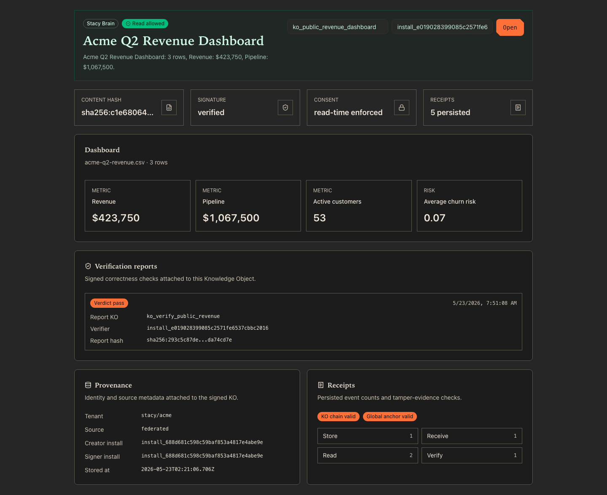
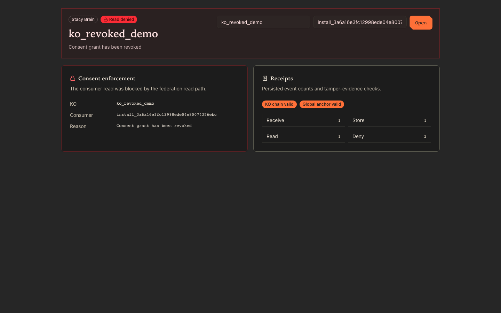
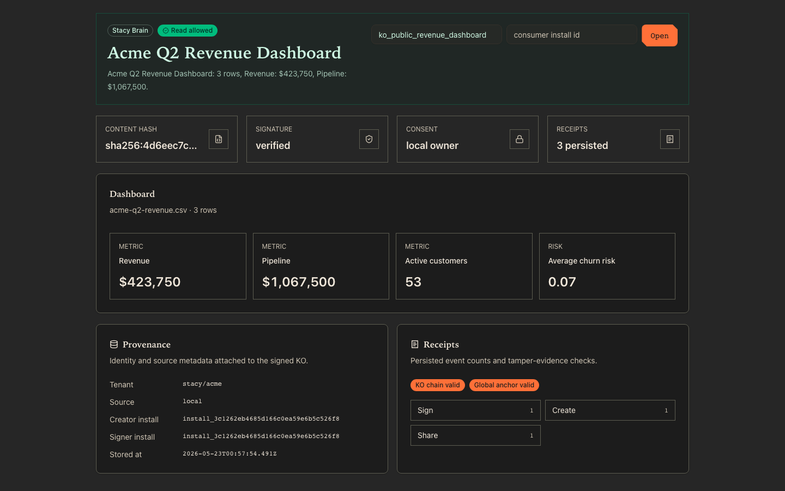

# Stacy Federation Demo — A Working Walkthrough

> *Two installs, one signed Knowledge Object, federated under consent, revoked at read time, with a tamper-evident receipt trail on both sides — proven end-to-end in under thirty seconds, on a freshly cloned repo.*

**Branch under test:** [`federation-demo-product-readiness-qv`](https://github.com/StacyOS/stacy-cli/tree/federation-demo-product-readiness-qv) (HEAD `7c03699e Add signed verification reports for federated KOs`).
**Status:** every gate verified locally (5 verifications below); 3-of-3 repeat gate slowest run **29.09 s**.
**Audience:** engineers and product folks who want to understand what was built, why it matters, and how to run it themselves.
**What's new in `7c03699e`:** a fifth signed primitive — **verification reports**. A consumer can now produce a signed, persisted, hash-chained attestation of *what they verified about a KO* — signature, content-shape contract, source-input reconciliation, deterministic-reconstruction check — and the UI surfaces those attestations as a panel on the brain page. See §"Verification reports" below.

---

## What you'll see

The demo ships a real React + TypeScript page that renders any signed Knowledge Object on a Stacy install, together with its provenance, consent status, signature verification, and per-event receipt counts. Below are three real screenshots, captured from a live two-install demo running on my laptop.

### Screen 1 — Install B reads a federated KO and shows a signed verification report



What you're looking at (top to bottom):

- **Header (green tint).** The `Stacy Brain` chip plus the `Read allowed` badge mean: the federation read path completed, signature verified, content hash matched, consent grant was valid, no revocation tombstone applied.
- **Four proof tiles.** Content hash (`sha256:c1e68064...`), signature status (`verified`), consent status (`read-time enforced` — meaning B is reading a *federated* KO, not a local one), and receipt count (**5 persisted**, up from 4 — the new "verify" event from the verification report below).
- **The dashboard.** The KO's content is a structured dashboard rendered as four widgets: Revenue $423,750, Pipeline $1,067,500, Active customers 53, Average churn risk 0.07. The source is shown right above the widgets: `acme-q2-revenue.csv · 3 rows`.
- **Verification reports panel (new in `7c03699e`).** Below the dashboard, a single `Verdict pass` card shows B's signed attestation of what they verified — the **Report KO** ID (`ko_verify_public_revenue`), the **Verifier** install ID (B's own keypair signed it), and the **Report hash** (the verification report is itself a signed Knowledge Object, content-addressed). If any check had failed or warned, that would appear as `Failed: …` / `Warnings: …` text on this card.
- **Provenance panel.** Tenant `stacy/acme`, source `federated`, producer install ID, signer install ID, stored-at timestamp. All attached to the KO itself, not assembled by the UI.
- **Receipts panel.** Two badges confirm both tamper-evidence chains are intact: the per-KO hash chain and the instance-level global anchor chain. Below: Store 1, Receive 1, Read 2, **Verify 1** (the new event type appended when the verification KO was created).

The first 4-receipt screenshot from before the verification primitive landed is preserved for reference at `stacy-federation-demo-screenshots/01-allowed.png` — same render, no Verification reports panel, four receipts instead of five.

### Screen 2 — Same KO ID after producer revoked the grant



This is the *same* federation read path, hitting a different KO (`ko_revoked_demo`) whose grant was revoked by the producer one second ago. Note:

- The header is now red-tinted with a `Read denied` badge.
- The reason — `Consent grant has been revoked` — is the exact string returned by the read-time enforcement predicate. No content body is rendered. No content body is even fetched from the database.
- The **same** two tamper-evidence chains pass (KO chain valid, Global anchor valid) — because the revocation didn't tamper with anything, it appended a tombstone and the consumer chose to honor it.
- The receipts panel now includes a `Deny: 2` row. Every denied read produces a `deny` receipt; nothing is silent.

### Screen 3 — Install A views its own KO (the producer side)



Same KO ID as Screen 1, but read from the install that *produced* it:

- **Consent tile changes to `local owner`** — there is no consent grant in play; the install owns the KO outright.
- **Provenance source is `local`** instead of `federated`. There's no `receivedFrom` field.
- **Receipts are different**: this side has `Sign 1`, `Create 1`, `Share 1`. The consumer side had `Receive`, `Store`, `Read`. The protocol records both halves of every exchange independently.

The same React component renders all three states. The data difference is exactly the difference between producer and consumer roles in the protocol.

---

## The 30-second pitch

A *Knowledge Object* (KO) is a signed, content-addressed JSON capsule. You generate one on install A, hand it to install B under a per-object consent grant, and B can read it — but only as long as A hasn't revoked the grant. B checks revocation at read time, on B's terms, against an endpoint A hosts. No background sync, no central registry, no shared trust root other than each install's Ed25519 keypair.

The demo proves all of this end to end:

1. Install A creates a signed dashboard KO from a real CSV file.
2. Install A registers Install B in its address book via a signed contact card B exported.
3. Install A federates the KO to B with a 30-day revocable read grant.
4. Install B reads the KO. The federation read path verifies the producer signature, checks the consent grant, fetches the latest revocation state from A, and either returns the content or returns a deny reason.
5. Install A revokes the KO.
6. Install B reads again. The next read is denied. The producer did not push anything to B; B picked up the new state at read time.
7. Both installs end with an append-only receipt log that records every event, hash-chained per KO and anchored in an instance-wide chain.

Total runtime: **~24 seconds**, repeated three out of three runs cleanly.

---

## What this demo proves (and what it intentionally doesn't)

**Proves:**
- Identity is keypair-anchored, not registry-anchored. There is no Stacy server you need to trust.
- KOs are content-addressed. Tampering with any field — content, tenant, hash, signature — falsifies the verification.
- Consent is *per object*. It is not a role, not a tenant flag, not a group — it is a signed grant binding one producer, one consumer, one KO, one scope, one expiry.
- Revocation is *consumer-pulled*, not *producer-pushed*. The producer hosts a revocation endpoint; the consumer queries it on every read. There is no fan-out, no eventual consistency, no broadcast.
- Audit is *tamper-evident*, not just append-only. Two hash chains (per-KO + instance-wide) make it structurally impossible to delete receipts without leaving evidence.
- Transport is *hardened*: every federation message carries a signed nonce and timestamp; replays within the 60-second freshness window are caught against a Postgres-backed nonce log; production endpoints require HTTPS (loopback HTTP is permitted only for local demos).
- The adapter seam is *opt-in and bounded*: any external LLM call requires explicit operator acknowledgement (`--ack-egress`), a kill timeout, an optional binary allowlist, and (when JSON mode is enabled) schema validation of the LLM's output before it lands in a KO.

**Does not prove:**
- That an LLM produces correct dashboards. The default generator is deterministic. The adapter path is for experimentation; it's not the credibility claim.
- That this scales to ten thousand installs. The *protocol* composes pairwise and is structurally `O(1)` per message. Discovery, certificate distribution, and operational ergonomics are deployment problems for which this branch ships an operator preflight (`demo:remote:preflight`) but no production runbook.
- That a malicious producer cannot withhold revocation tombstones. The trust model assumes the producer is honest about its own revocations. Byzantine-fault-tolerant federation is out of scope.

---

## Architecture at a glance

```
┌────────────────── Install A (producer) ─────────────────┐         ┌────────────────── Install B (consumer) ─────────────────┐
│                                                          │         │                                                          │
│   ┌──────────────┐   ┌──────────────────────────────┐   │         │   ┌──────────────────────────────┐   ┌──────────────┐   │
│   │ Stacy CLI    │ → │ packages/federation          │   │         │   │ packages/federation          │ ← │ Stacy CLI    │   │
│   │ + UI         │   │  • identity (Ed25519)        │   │         │   │  • identity (Ed25519)        │   │ + UI         │   │
│   │              │   │  • ko (sign + verify)        │   │         │   │  • ko (verify)               │   │              │   │
│   │ stacy run    │   │  • consent (grant)           │   │ HTTPS   │   │  • consent (enforce)         │   │ stacy brain  │   │
│   │ stacy share  │   │  • sync (nonce + replay)     │   │ POST    │   │  • sync (claim nonce)        │   │   show       │   │
│   │ stacy revoke │   │  • contacts (signed cards)   │   │ /api/   │   │  • contacts (verify cards)   │   │   --as-      │   │
│   │ stacy        │   │  • receipts (hash chain +    │   │ federa- │   │  • receipts (hash chain +    │   │   consumer   │   │
│   │   receipts   │   │     instance anchor)         │   │ tion    │   │     instance anchor)         │   │              │   │
│   └──────────────┘   └─────────────┬────────────────┘   │         │   └─────────────┬────────────────┘   └──────────────┘   │
│                                     │                    │ HTTPS   │                 │                                       │
│                                     ▼                    │ GET     │                 ▼                                       │
│                       ┌──────────────────────────┐       │ /api/   │   ┌──────────────────────────┐                          │
│                       │ Embedded Postgres        │  ◄────┼─revoca─◄┼   │ Embedded Postgres        │                          │
│                       │  • federation_knowledge_ │       │ tions   │   │  • federation_received_  │                          │
│                       │    objects               │       │         │   │    nonces                │                          │
│                       │  • federation_consent_   │       │         │   │  • (same six tables)     │                          │
│                       │    grants                │       │         │   └──────────────────────────┘                          │
│                       │  • federation_revocation_│       │         │                                                          │
│                       │    tombstones            │       │         │                                                          │
│                       │  • federation_receipts   │       │         │                                                          │
│                       │  • federation_receipt_   │       │         │                                                          │
│                       │    anchors               │       │         │                                                          │
│                       │  • federation_receipt_   │       │         │                                                          │
│                       │    chain_head            │       │         │                                                          │
│                       └──────────────────────────┘       │         │                                                          │
└──────────────────────────────────────────────────────────┘         └──────────────────────────────────────────────────────────┘
```

The only protocol-level connection between the two installs is HTTPS (or, in the local demo, loopback HTTP). All shared state lives on disk on each side. The only thing both installs are configured to trust is the tenant identifier `stacy/acme` — every other piece of trust is verified from first principles, signature by signature.

---

## The five trust primitives

Everything in the demo composes from these four signed object types. They all use the same construction:

```
unsigned  = { kind, schemaVersion, tenant, …type-specific fields…, createdAt }
hash      = "sha256:" + sha256_hex(canonical_json(unsigned))
signed    = unsigned + { hash_field: hash }
signature = ed25519_sign(producer_private_key, canonical_json(signed))
envelope  = { id, signedPayload: signed, signer: {installId, publicKeyPem}, signature }
```

`canonical_json` is RFC-8785-style: lexicographic key order, no whitespace, no `undefined`. The same canonicalization function is used everywhere, so a verifier on B reconstructs the exact bytes A signed.

### Primitive 1 — Knowledge Object

The unit of federated content. Fields: `tenant, creatorInstallId, contentType, content, createdAt`. The content is any canonical-JSON value — in the demo, it's a structured dashboard object with widgets.

### Primitive 2 — Consent Grant

Produced by the same install that produced the KO. Fields: `tenant, koId, koContentHash, producerInstallId, consumerInstallId, scope ("read"), expiresAt, revocable, createdAt`. The grant is bound to the specific content hash, so re-signing a different KO with the same `koId` will not satisfy the same grant.

### Primitive 3 — Revocation Tombstone

Also producer-signed. Fields: `tenant, koId, koContentHash, issuerInstallId, reason, revokedGrantId?, createdAt`. Stored on the producer's revocation endpoint. The consumer fetches it at read time.

### Primitive 4 — Signed Contact Card

The discovery layer. Fields: `name, label, installId, publicKeyPem, federationEndpointUrl, revocationUrl, tenant, createdAt`. Verification on import asserts that `installId == "install_" + sha256(publicKeyPem)[0..32]`. That binding is what makes contact cards a credible substitute for a directory service: even if an attacker hand-edits the JSON to claim a different install ID, the binding check fails.

### Primitive 5 — Signed Verification Report *(new in `7c03699e`)*

The closing-the-loop layer. Until this commit, the consumer's role in the protocol ended at "I read the KO and it verified." There was no way for the consumer to *attest* publicly to that fact — no signed evidence that B actually looked at the content, ran the checks, and signed off.

A verification report is a Knowledge Object (so all the primitive-1 guarantees apply to it), but its `content` is a structured assertion: which source KO was verified, what checks were run, and what the overall verdict is. The shape (from [`src/verification/verification-report.ts`](https://github.com/StacyOS/stacy-cli/blob/federation-demo-product-readiness-qv/packages/federation/src/verification/verification-report.ts)):

```ts
interface VerificationReportContent {
  kind: "verification_report";
  schemaVersion: 1;
  source: {
    koId: string;
    koContentHash: string;
    producerInstallId: string;
    contentType: string;
  };
  verifierInstallId: string;
  verdict: "pass" | "fail";
  checks: VerificationCheck[];   // each: { id, status: "pass"|"fail"|"warn", summary, details }
  createdAt: string;
}
```

The signer of the report is the *verifier* (the consumer that ran the checks), not the producer. So a verification report on B's install is a B-signed statement *about* an A-signed KO, persisted on B and reportable to A, C, D, or anyone B chooses to federate it to.

The check set is content-type-aware. For a `kind: "dashboard"` KO, the demo runs four checks:

1. **`signed_ko_verified`** — passes once the KO's signature and content hash verify. (The CLI verifies on read, so this is structurally "pass" or the read failed before we got here.)
2. **`dashboard_contract`** — title is a string, summary is a string, widgets array is non-empty.
3. **`source_input_reconciled`** — *if the verifier supplies the source CSV*, the file name, content hash, and row count recorded in the KO match the actual file on disk. Catches the case where a producer claims a KO came from `quarterly.csv` but actually built it from a different file.
4. **`deterministic_reconciliation`** — *if the verifier supplies both the CSV and the schema*, the KO's widgets are re-derived deterministically from the CSV via the schema. If the widgets in the KO don't byte-equal the deterministic reconstruction, the check warns. (This is a `warn`, not a `fail`, because adapter-generated KOs legitimately have widgets that *don't* match deterministic reconstruction.)

Two more check sets exist for other content kinds (`report` → `report_contract`, `table` → `table_contract`). Any unknown `kind` produces a `warn` saying "no specialized verifier is registered."

**Verdict rule:** any `fail` → `verdict: "fail"`. Otherwise `verdict: "pass"`. A `warn` doesn't fail the verdict but is surfaced in the UI.

CLI surface:

```bash
stacy brain verify ko_public_revenue_dashboard \
  --input demo/acme-q2-revenue.csv \
  --schema demo/acme-dashboard.schema.json \
  --ko-id ko_verify_public_revenue \
  --json
```

This:
1. Reads the source KO from the local DB (signature + content hash verified at this step).
2. Constructs the `VerificationReportContent` with the four checks above.
3. Wraps it as a Knowledge Object (signed by the verifier's install identity, content type `application/vnd.stacy.verification-report+json`).
4. Persists the new KO locally.
5. Appends a `verify` receipt event for the **source** KO ID, with the verification KO ID and the failed/warning check IDs in the receipt payload.

That last step is what makes the report visible in the UI. The federation-brain server route summarizes all `verify` receipts for a given KO and ships them to the UI as the `verificationReports` array. The new `VerificationReportsPanel` React component (in [`ui/src/pages/FederationBrain.tsx`](https://github.com/StacyOS/stacy-cli/blob/federation-demo-product-readiness-qv/ui/src/pages/FederationBrain.tsx)) renders one card per report with the verdict, verifier, report content hash, and (when present) failed/warning check IDs.

---

## The single function this entire system protects

If you read only one piece of code in the federation package, read this one. It's the predicate every federated read passes through. Source: [`packages/federation/src/consent/enforcement.ts`](https://github.com/StacyOS/stacy-cli/blob/federation-demo-product-readiness-qv/packages/federation/src/consent/enforcement.ts) (simplified):

```ts
export function enforceReadConsent(input: {
  ko: SignedKnowledgeObject;
  grant: SignedConsentGrant | null;
  revocation?: SignedRevocationTombstone | null;
  consumerInstallId: string;
  now: Date;
}): { ok: true } | { ok: false; reason: string } {
  // 1. The KO itself must verify (signature + content hash).
  const koCheck = verifyKnowledgeObject(input.ko);
  if (!koCheck.ok) return { ok: false, reason: "Knowledge Object failed verification" };

  // 2. There must be a grant.
  if (!input.grant) return { ok: false, reason: "Missing consent grant" };

  // 3. The grant must verify (signature).
  const grantCheck = verifyConsentGrant(input.grant);
  if (!grantCheck.ok) return { ok: false, reason: "Consent grant failed verification" };

  // 4. The grant must cover THIS KO (hash, producer, consumer, tenant, scope).
  const p = input.grant.signedPayload;
  if (p.koContentHash !== input.ko.signedPayload.contentHash)        return { ok: false, reason: "Grant does not cover this KO" };
  if (p.producerInstallId !== input.ko.signedPayload.creatorInstallId) return { ok: false, reason: "Grant producer mismatch" };
  if (p.consumerInstallId !== input.consumerInstallId)                return { ok: false, reason: "Grant consumer mismatch" };
  if (p.tenant !== input.ko.signedPayload.tenant)                     return { ok: false, reason: "Grant tenant mismatch" };
  if (p.scope !== "read")                                             return { ok: false, reason: "Grant scope is not read" };

  // 5. The grant must not be expired.
  if (input.now.getTime() >= Date.parse(p.expiresAt))                 return { ok: false, reason: "Consent grant is expired" };

  // 6. There must be no matching revocation tombstone.
  if (input.revocation)                                               return { ok: false, reason: "Consent grant has been revoked" };

  return { ok: true };
}
```

Everything else in the federation package — the signing discipline, the hash chains, the replay protection, the contact cards, the receipt logging, the transport-URL policy — exists to make sure each input to this predicate is trustworthy. If you understand this predicate, you understand the whole demo.

---

## Walkthrough of the important code

### Signing a Knowledge Object

[`packages/federation/src/ko/knowledge-object.ts`](https://github.com/StacyOS/stacy-cli/blob/federation-demo-product-readiness-qv/packages/federation/src/ko/knowledge-object.ts) (simplified):

```ts
export function createKnowledgeObject(options: {
  tenant: string;
  contentType: string;
  content: CanonicalJsonValue;
  identity: InstallIdentity;
  createdAt: Date;
}): SignedKnowledgeObject {
  // 1. Build the unsigned payload.
  const unsigned: KnowledgeObjectUnsignedPayload = {
    kind: "knowledge_object",
    schemaVersion: 1,
    tenant: options.tenant,
    creatorInstallId: options.identity.record.installId,
    contentType: options.contentType,
    content: options.content,
    createdAt: options.createdAt.toISOString(),
  };

  // 2. Hash the canonical bytes.
  const contentHash = `sha256:${sha256Hex(canonicalBytes(unsigned))}`;

  // 3. Build the signed payload (unsigned + content hash).
  const signedPayload = { ...unsigned, contentHash };

  // 4. Ed25519 sign the canonical bytes of the signed payload.
  const signature = sign(null, canonicalBytes(signedPayload), options.identity.privateKey);

  // 5. Wrap in an envelope that includes the signer's identity.
  return {
    id: contentHash,
    signedPayload,
    signer: {
      installId: options.identity.record.installId,
      publicKeyPem: options.identity.record.publicKeyPem,
    },
    signature: signature.toString("base64"),
  };
}
```

The `id` of a KO is its content hash. Two KOs with identical content (and identical metadata) deduplicate naturally; two KOs with any byte of difference get different IDs. Verifying a KO recomputes the hash, recomputes the bytes, and runs `ed25519_verify`. No trust required beyond knowing the producer's public key — which is bound into the KO via the install ID derivation.

### Atomic replay protection on the receiver

When install A delivers a federation message to install B over HTTPS, B's receive path checks freshness *after* signature verification and *before* any storage. [`packages/federation/src/sync/received-nonce-store.ts`](https://github.com/StacyOS/stacy-cli/blob/federation-demo-product-readiness-qv/packages/federation/src/sync/received-nonce-store.ts):

```ts
export async function claimReceivedNonce(options: ClaimReceivedNonceOptions): Promise<boolean> {
  await ensureReceivedNonceTables(options.db);

  // Garbage-collect expired nonces in the same transaction.
  await options.db.execute(sql`
    DELETE FROM federation_received_nonces
    WHERE expires_at <= ${options.receivedAt.toISOString()}
  `);

  // Try to insert. Composite primary key (producer_install_id, nonce) makes this atomic.
  const rows = await options.db.execute(sql`
    INSERT INTO federation_received_nonces (producer_install_id, nonce, received_at, expires_at)
    VALUES (${options.producerInstallId}, ${options.nonce},
            ${options.receivedAt.toISOString()}, ${options.expiresAt.toISOString()})
    ON CONFLICT (producer_install_id, nonce) DO NOTHING
    RETURNING nonce
  `);

  return rows.length === 1;
}
```

If the `RETURNING` clause yields one row, the nonce is fresh and the message is processed. If it yields zero rows, the nonce was already accepted — the message is a replay and is rejected. Because the check is durable in Postgres, the guarantee survives B-side restarts. The 60-second window means the table never grows unboundedly.

### Tamper-evident receipts in two layers

The per-KO chain links every receipt to the previous receipt for the *same KO*. Source: [`packages/federation/src/receipts/receipt-store.ts`](https://github.com/StacyOS/stacy-cli/blob/federation-demo-product-readiness-qv/packages/federation/src/receipts/receipt-store.ts):

```ts
const previousReceiptHash = await readReceiptChainTailHash({
  db: options.db,
  koId: options.koId,
});
const unsignedReceipt = {
  id, eventType, tenant, koId, actorInstallId, counterpartyInstallId,
  payload, createdAt,
  previousReceiptHash: previousReceiptHash ?? undefined,
};
const receiptHash = `sha256:${sha256Hex(canonicalize(unsignedReceipt))}`;
```

The instance-level anchor chain advances on *every* receipt insertion, regardless of KO. The pseudocode:

```ts
async function appendReceiptAnchor({ db, receipt }) {
  const previousAnchor = await readReceiptChainHead(db);   // null if first
  const anchor = {
    id: `anchor_${randomUUID()}`,
    previousAnchorHash: previousAnchor?.anchorHash,
    receiptId: receipt.id,
    receiptHash: receipt.receiptHash,
    createdAt: new Date().toISOString(),
  };
  const anchorHash = `sha256:${sha256Hex(canonicalize(anchor))}`;
  await insertAnchor({ ...anchor, anchorHash });
  await upsertChainHead({ anchorHash });
}
```

The combined property: per-KO chain catches in-flight edits of a single KO's receipts; instance-level chain catches wholesale deletions across KOs. Verifying both is a single CLI call:

```bash
stacy receipts verify --ko ko_public_revenue_dashboard
# → Receipt chain valid. Checked 4 receipt(s).

stacy receipts verify --anchor
# → Global receipt anchor chain valid. Checked 17 anchor(s).
```

These same two checks back the green "KO chain valid" and "Global anchor valid" badges in the UI.

### The adapter seam — explicit, bounded, validated

The Q3 storyboard tile said `stacy run "build a quarterly revenue dashboard from this CSV"`. That command exists, and it is intentionally deterministic by default — the same task and the same CSV produce the same KO every run, because that's what a demo gate needs.

The adapter seam is for when you want a real LLM to own the dashboard. From [`packages/federation/verbs/run-task.ts`](https://github.com/StacyOS/stacy-cli/blob/federation-demo-product-readiness-qv/packages/federation/verbs/run-task.ts):

```ts
const adapterCommand = options.adapterCommand?.trim();
if (adapterCommand && !options.ackEgress) {
  throw new Error("Adapter execution may send input records outside this install. Re-run with --ack-egress to confirm.");
}

const adapterOutput = adapterCommand
  ? await runAdapterCommand({
      command: adapterCommand,
      args:    options.adapterArg ?? [],
      stdin:   JSON.stringify({ task, input: adapterInput, redactedColumns }, null, 2),
      timeoutMs:        parseAdapterTimeoutMs(options.adapterTimeoutMs),  // default 60_000
      allowedAdapters:  parseAllowedAdapters(env.STACY_PUBLIC_DEMO_ALLOWED_ADAPTERS),
    })
  : undefined;

// In JSON mode, parse adapter stdout against AdapterDashboardOutput contract.
// Invalid JSON throws BEFORE the KO is created.
const adapterDashboard = adapterOutput && adapterOutputMode === "json"
  ? parseAdapterDashboardOutput(adapterOutput)
  : undefined;
```

Five guardrails in one function:
1. `--ack-egress` is required if any adapter is set. Egress is never silent.
2. `--redact-column <name>` (or `STACY_PUBLIC_DEMO_REDACT_COLUMNS=col1,col2`) drops sensitive columns from the JSON sent to the adapter, while the KO still records the original `contentHash` of the unredacted CSV.
3. `STACY_PUBLIC_DEMO_ALLOWED_ADAPTERS=claude,codex` restricts which binaries `spawn` will execute.
4. A hard `setTimeout(SIGKILL, 60_000)` kills hung adapters.
5. `--adapter-output json` parses the adapter's stdout against a strict dashboard schema (non-empty widgets array, valid kind/label/value). Invalid output fails before any KO is signed.

When the adapter contract is met, the LLM owns the dashboard's *presentation* (title, summary, widgets, notes). The KO still records the *provenance* (file name, content hash, row count) computed deterministically from the actual CSV bytes. The producer cannot lie about which file was used; the adapter cannot lie about producer identity.

---

## Try it yourself — three levels of reproducer

The repo is structured so that you can run the demo at three levels of fidelity, from "just verify it works" to "see the UI on your own machine."

### Level 1 — Verify everything still works (1 minute)

```bash
git clone https://github.com/StacyOS/stacy-cli.git
cd stacy-cli
git checkout federation-demo-product-readiness-qv
pnpm install
pnpm --filter @arpanstacy/stacy-federation demo:check
```

Expected: preflight ✓, typecheck ✓, **7 acceptance tests** (in-memory protocol correctness), **4 real DB smoke tests** (against embedded Postgres), **4 real two-install server smoke tests** (real child processes, real HTTP). Total around 60-90 seconds on the new `7c03699e` HEAD. The verification primitive is exercised by additional module-level unit tests in `src/brain/verification-brain.test.ts` and `verbs/brain-verify.test.ts` which run as part of `pnpm --filter @arpanstacy/stacy-federation test`.

### Level 2 — Watch the public demo run end to end (30 seconds)

```bash
pnpm --filter @arpanstacy/stacy-federation demo:public
```

This is the literal storyboard. The test harness:
1. Creates two isolated installs with different home dirs, configs, secrets, and Postgres ports.
2. Boots both Stacy servers as real child processes.
3. B exports a signed contact card; A imports it as `meera`.
4. A runs `stacy run "..." --input demo/acme-q2-revenue.csv --schema demo/acme-dashboard.schema.json --ko-id ko_public_revenue_dashboard`.
5. A shares the KO with `--with-contact meera`.
6. B reads the KO under Meera's install ID (succeeds).
7. A revokes.
8. B reads again (fails with `Consent grant has been revoked`).
9. Both installs verify their per-KO chain and instance-anchor chain.
10. Prints a summary block with all KO IDs, content hashes, install IDs, and per-event receipt counts.

For the 3-out-of-3 repeat gate (the version you should run before any external presentation):

```bash
STACY_FEDERATION_PUBLIC_DEMO_REPEAT=3 pnpm --filter @arpanstacy/stacy-federation demo:public:repeat
```

The hardest of three repeated runs typically completes in ~25 seconds, well under the 4-minute storyboard bar.

To also exercise the adapter seam (using a bundled fake adapter that just echoes a stdin summary — no LLM call, no network egress):

```bash
pnpm --filter @arpanstacy/stacy-federation demo:public:adapter-smoke
```

You should see `Generator: adapter_command` in the output instead of `deterministic_dashboard`.

### Level 3 — See the UI on your own machine

The public-demo smoke runs the demo inside a test harness that tears itself down after each run. To keep the demo alive long enough to open the UI in a browser, do this:

#### Step 1 — Build the UI bundle so the Stacy server can serve it

```bash
pnpm --filter @arpanstacy/stacy-ui build
```

This produces `ui/dist/`, which the Stacy server picks up automatically when `server.serveUi` is true (it is, by default, in the harness configs).

#### Step 2 — Save the keep-alive runner

Save this file as `/tmp/keep-alive-demo.mjs`:

```js
// Long-lived federation demo: spins up two installs, populates state, keeps servers up.
import { resolve, join } from "node:path";
import { homedir } from "node:os";

const REPO_ROOT = resolve(homedir(), "dev/stacy-cli");      // adjust to your clone path
const FEDERATION_DIR = join(REPO_ROOT, "packages/federation");

async function main() {
  process.chdir(REPO_ROOT);
  const { createTwoInstallHarness } = await import(
    `${REPO_ROOT}/packages/federation/test/harness/two-install-harness.ts`
  );
  const { loadInstallIdentity } = await import(
    `${REPO_ROOT}/packages/federation/src/identity/install-identity.ts`
  );
  const { resolveFederationIdentityPath } = await import(
    `${REPO_ROOT}/packages/federation/src/identity/paths.ts`
  );

  const demoCsvPath = join(FEDERATION_DIR, "demo/acme-q2-revenue.csv");
  const demoSchemaPath = join(FEDERATION_DIR, "demo/acme-dashboard.schema.json");

  const harness = await createTwoInstallHarness();
  try {
    await harness.prepare();
    await harness.startServer("A", { timeoutMs: 60_000, intervalMs: 500 });
    await harness.startServer("B", { timeoutMs: 60_000, intervalMs: 500 });

    // Seed B's install identity by creating a throwaway local KO on B.
    await harness.runCli("B", [
      "brain", "create",
      "--config", harness.installB.configPath,
      "--content-json", JSON.stringify({ title: "Meera identity seed" }),
      "--ko-id", "ko_meera_identity_seed",
      "--json",
    ]);
    const consumerIdentity = await loadInstallIdentity(
      resolveFederationIdentityPath(harness.installB.instanceRoot),
    );

    // Exchange a signed contact card.
    const contactCardPath = join(harness.rootDir, "meera.contact-card.json");
    await harness.runCli("B", [
      "contacts", "export", "meera",
      "--config", harness.installB.configPath,
      "--endpoint", `http://127.0.0.1:${harness.installB.serverPort}/api/federation`,
      "--revocation-url", `http://127.0.0.1:${harness.installB.serverPort}/api/federation/revocations`,
      "--label", "Meera's Stacy install",
      "--out", contactCardPath,
    ]);
    await harness.runCli("A", [
      "contacts", "import", contactCardPath,
      "--config", harness.installA.configPath,
      "--as", "meera",
      "--json",
    ]);

    // Create + share the allowed KO.
    await harness.runCli("A", [
      "run", "build a quarterly revenue dashboard from this CSV",
      "--config", harness.installA.configPath,
      "--input", demoCsvPath,
      "--schema", demoSchemaPath,
      "--ko-id", "ko_public_revenue_dashboard",
      "--json",
    ]);
    await harness.runCli("A", [
      "share", "ko_public_revenue_dashboard",
      "--config", harness.installA.configPath,
      "--with-contact", "meera",
      "--revocation-url", `http://127.0.0.1:${harness.installA.serverPort}/api/federation/revocations`,
      "--expires", "30d",
      "--revocable",
      "--json",
    ]);
    await harness.runCli("B", [
      "brain", "show", "ko_public_revenue_dashboard",
      "--config", harness.installB.configPath,
      "--as-consumer", consumerIdentity.record.installId,
      "--json",
    ]);

    // NEW (7c03699e) — B issues a signed verification report against the federated KO.
    // This populates the Verification reports panel in the UI.
    await harness.runCli("B", [
      "brain", "verify", "ko_public_revenue_dashboard",
      "--config", harness.installB.configPath,
      "--input", demoCsvPath,
      "--schema", demoSchemaPath,
      "--ko-id", "ko_verify_public_revenue",
      "--json",
    ]);

    // Create, share, then revoke a second KO to demo the denied path.
    for (const koId of ["ko_revoked_demo"]) {
      await harness.runCli("A", [
        "run", "build a quarterly revenue dashboard from this CSV",
        "--config", harness.installA.configPath,
        "--input", demoCsvPath,
        "--schema", demoSchemaPath,
        "--ko-id", koId,
        "--json",
      ]);
      await harness.runCli("A", [
        "share", koId,
        "--config", harness.installA.configPath,
        "--with-contact", "meera",
        "--revocation-url", `http://127.0.0.1:${harness.installA.serverPort}/api/federation/revocations`,
        "--expires", "30d",
        "--revocable",
        "--json",
      ]);
      await harness.runCli("B", [
        "brain", "show", koId,
        "--config", harness.installB.configPath,
        "--as-consumer", consumerIdentity.record.installId,
        "--json",
      ]);
      await harness.runCli("A", [
        "revoke", koId,
        "--config", harness.installA.configPath,
        "--reason", "Quarter closed",
        "--json",
      ]);
      await harness.runCli("B", [
        "brain", "show", koId,
        "--config", harness.installB.configPath,
        "--as-consumer", consumerIdentity.record.installId,
        "--json",
      ]);
    }

    console.log(JSON.stringify({
      installA: { url: `http://127.0.0.1:${harness.installA.serverPort}` },
      installB: { url: `http://127.0.0.1:${harness.installB.serverPort}` },
      consumerInstallId: consumerIdentity.record.installId,
      koIds: { allowed: "ko_public_revenue_dashboard", revoked: "ko_revoked_demo" },
    }, null, 2));
    console.error("[keep-alive] Press Ctrl-C to tear down.");

    await new Promise((resolveWait) => {
      const stop = async () => { try { await harness.stop(); } catch {} resolveWait(); };
      process.on("SIGINT", stop);
      process.on("SIGTERM", stop);
    });
  } catch (err) {
    console.error("[keep-alive] error:", err);
    try { await harness.stop(); } catch {}
    process.exit(1);
  }
}

main();
```

#### Step 3 — Run the keep-alive script

```bash
cd ~/dev/stacy-cli
node cli/node_modules/tsx/dist/cli.mjs /tmp/keep-alive-demo.mjs
```

After about 25 seconds you'll see a JSON block with the install URLs and the consumer install ID, plus `[keep-alive] Press Ctrl-C to tear down.`

#### Step 4 — Open the three views in your browser

Replace `<port>` with the port from the JSON output (it's deterministic per PID, usually in the 41xxx-48xxx range):

- **Consumer side, allowed read:**
  `http://127.0.0.1:<install-B-port>/federation/brain/ko_public_revenue_dashboard?asConsumer=<consumer-install-id>`
- **Consumer side, denied read after revoke:**
  `http://127.0.0.1:<install-B-port>/federation/brain/ko_revoked_demo?asConsumer=<consumer-install-id>`
- **Producer side, local view:**
  `http://127.0.0.1:<install-A-port>/federation/brain/ko_public_revenue_dashboard`

These are the exact three pages I screenshotted at the top of this document.

When you're done, Ctrl-C in the terminal running the keep-alive script. The harness tears down both servers, deletes the embedded Postgres data directories, and releases the ports.

---

## A small bestiary of file paths

If you want to navigate the code yourself, here are the highest-signal files in the federation package, in roughly the order you'd want to read them.

| File | What's there |
|---|---|
| [`SPEC.md`](https://github.com/StacyOS/stacy-cli/blob/federation-demo-product-readiness-qv/packages/federation/SPEC.md) | The source of truth. Canonical serialization, KO shape, consent grant shape, revocation tombstone shape, contact cards, replay protection, receipt chains, read-time enforcement. Read this first. |
| [`src/consent/enforcement.ts`](https://github.com/StacyOS/stacy-cli/blob/federation-demo-product-readiness-qv/packages/federation/src/consent/enforcement.ts) | The read-time predicate. The 8-line function whose correctness is the demo. |
| [`src/ko/knowledge-object.ts`](https://github.com/StacyOS/stacy-cli/blob/federation-demo-product-readiness-qv/packages/federation/src/ko/knowledge-object.ts) | Knowledge Object creation + verification. |
| [`src/consent/grant.ts`](https://github.com/StacyOS/stacy-cli/blob/federation-demo-product-readiness-qv/packages/federation/src/consent/grant.ts) | Consent grant creation + verification. |
| [`src/consent/revocation.ts`](https://github.com/StacyOS/stacy-cli/blob/federation-demo-product-readiness-qv/packages/federation/src/consent/revocation.ts) | Revocation tombstone construction. |
| [`src/contacts/contact-card.ts`](https://github.com/StacyOS/stacy-cli/blob/federation-demo-product-readiness-qv/packages/federation/src/contacts/contact-card.ts) | Signed contact card create + verify (the discovery layer). |
| [`src/verification/verification-report.ts`](https://github.com/StacyOS/stacy-cli/blob/federation-demo-product-readiness-qv/packages/federation/src/verification/verification-report.ts) | **New in `7c03699e`.** Verification report content type + check assembly. The signed attestation B issues about A's KO. |
| [`src/brain/verification-brain.ts`](https://github.com/StacyOS/stacy-cli/blob/federation-demo-product-readiness-qv/packages/federation/src/brain/verification-brain.ts) | **New.** Glue between report assembly and KO creation. Reads the source KO, builds the report, wraps it as a signed KO, appends a `verify` receipt. |
| [`verbs/brain-verify.ts`](https://github.com/StacyOS/stacy-cli/blob/federation-demo-product-readiness-qv/packages/federation/verbs/brain-verify.ts) | **New.** `stacy brain verify <ko_id> [--input <csv>] [--schema <json>]`. |
| [`src/sync/federation-message.ts`](https://github.com/StacyOS/stacy-cli/blob/federation-demo-product-readiness-qv/packages/federation/src/sync/federation-message.ts) | The HTTP-shaped envelope, nonce, freshness check, replay guard wiring. |
| [`src/sync/received-nonce-store.ts`](https://github.com/StacyOS/stacy-cli/blob/federation-demo-product-readiness-qv/packages/federation/src/sync/received-nonce-store.ts) | The atomic `INSERT … ON CONFLICT DO NOTHING RETURNING` SQL for replay protection. |
| [`src/sync/transport-policy.ts`](https://github.com/StacyOS/stacy-cli/blob/federation-demo-product-readiness-qv/packages/federation/src/sync/transport-policy.ts) | `https-only-off-loopback` check. |
| [`src/receipts/receipt-store.ts`](https://github.com/StacyOS/stacy-cli/blob/federation-demo-product-readiness-qv/packages/federation/src/receipts/receipt-store.ts) | Append, per-KO chain, instance-level anchor chain, verification. |
| [`src/dashboard/dashboard-content.ts`](https://github.com/StacyOS/stacy-cli/blob/federation-demo-product-readiness-qv/packages/federation/src/dashboard/dashboard-content.ts) | CSV parser + schema-driven dashboard generator + redaction. |
| [`src/dashboard/adapter-output.ts`](https://github.com/StacyOS/stacy-cli/blob/federation-demo-product-readiness-qv/packages/federation/src/dashboard/adapter-output.ts) | Adapter JSON contract (the LLM-output validator). |
| [`verbs/run-task.ts`](https://github.com/StacyOS/stacy-cli/blob/federation-demo-product-readiness-qv/packages/federation/verbs/run-task.ts) | `stacy run` implementation — wires CSV → adapter (optional) → KO creation. |
| [`verbs/share.ts`](https://github.com/StacyOS/stacy-cli/blob/federation-demo-product-readiness-qv/packages/federation/verbs/share.ts) | `stacy share` — uses contact book + transport-policy check + federation message creation. |
| [`verbs/revoke.ts`](https://github.com/StacyOS/stacy-cli/blob/federation-demo-product-readiness-qv/packages/federation/verbs/revoke.ts) | `stacy revoke` — produces the signed tombstone. |
| [`verbs/contacts.ts`](https://github.com/StacyOS/stacy-cli/blob/federation-demo-product-readiness-qv/packages/federation/verbs/contacts.ts) | `stacy contacts add/list/show/export/import`. |
| [`verbs/receipts.ts`](https://github.com/StacyOS/stacy-cli/blob/federation-demo-product-readiness-qv/packages/federation/verbs/receipts.ts) | `stacy receipts list / verify`. |
| [`test/harness/two-install-harness.ts`](https://github.com/StacyOS/stacy-cli/blob/federation-demo-product-readiness-qv/packages/federation/test/harness/two-install-harness.ts) | The two-install test harness used by every smoke. |
| [`test/harness/public-demo-smoke.test.ts`](https://github.com/StacyOS/stacy-cli/blob/federation-demo-product-readiness-qv/packages/federation/test/harness/public-demo-smoke.test.ts) | The executable storyboard. Your reference for what the full flow looks like. |

And on the server / UI side of the main repo:

| File | What's there |
|---|---|
| [`server/src/app.ts`](https://github.com/StacyOS/stacy-cli/blob/federation-demo-product-readiness-qv/server/src/app.ts) | Mounts `POST /api/federation` and `GET /api/federation/revocations` — the two HTTP endpoints used by the demo. |
| [`server/src/routes/federation-brain.ts`](https://github.com/StacyOS/stacy-cli/blob/federation-demo-product-readiness-qv/server/src/routes/federation-brain.ts) | The read-side API the UI calls. |
| [`server/src/config.ts`](https://github.com/StacyOS/stacy-cli/blob/federation-demo-product-readiness-qv/server/src/config.ts) | TLS config loader (`STACY_SERVER_TLS_*` env vars + `server.tls.*` config). |
| [`ui/src/pages/FederationBrain.tsx`](https://github.com/StacyOS/stacy-cli/blob/federation-demo-product-readiness-qv/ui/src/pages/FederationBrain.tsx) | The React page rendered in the screenshots above. |
| [`ui/src/api/federationBrain.ts`](https://github.com/StacyOS/stacy-cli/blob/federation-demo-product-readiness-qv/ui/src/api/federationBrain.ts) | The TanStack Query client that calls the federation-brain route. |

---

## Why this matters — the StacyOS thesis in one paragraph

The pitch on Stacy's storyboard reads: *"not a sandbox, not memory, not a crypto rail — a credibly neutral coordination layer between people and AI systems."* The federation demo is that thesis made executable. We are not building a hosted SaaS that holds your AI's memory. We are not building a blockchain that settles AI-to-AI contracts. We are not building a sandbox that contains AI execution. We are building a small set of protocol primitives — signed objects, per-object consent, read-time revocation, hash-chained audit — that let two installations coordinate without trusting each other's runtime and without depending on a third party. The unit test of that protocol is N=2 installs. If it composes at two, the same wire format composes at ten thousand. The protocol is structurally linear; deployment is the remaining problem.

The demo proves the protocol. The five commits (`1ed93dd1` → `e0f7e1e6` → `22051de3` → `c4d16984` → `a1892d83` → `df809597`) walk the substrate from raw primitives to a UI you can show a customer.

---

## Common questions

**Why deterministic content instead of a real LLM by default?**
Because a demo's gates have to be reproducible. If the dashboard numbers came from a model, the content hash would change every run, the receipt chain assertions would break, and the 3-out-of-3 repeat gate would be flaky. The adapter seam exists for when you want real-model output; the guardrails (`--ack-egress`, allowlist, timeout, JSON-schema validation) exist for when you want it *safely*.

**Is this a blockchain?**
No. There is no consensus algorithm, no proof-of-work, no proof-of-stake, no token, no global ledger. Trust is install-to-install pairwise via Ed25519 signatures. Storage is Postgres, not a Merkle tree. Receipts are hash-chained for tamper evidence, not for distributed agreement.

**What stops a malicious producer from withholding revocation tombstones?**
Nothing at the protocol level. The trust model assumes the producer is honest about its own revocations. Byzantine-fault tolerance (third-party witnesses, gossip, quorum) is out of scope for an N=2 demo. The threat model is documented in `SPEC.md` under *Explicit Non-Goals*.

**Does the consumer need to be online when the producer revokes?**
No — the producer doesn't push anything. The consumer fetches the latest revocation state at *its* next read. If the consumer never reads again, the revocation never takes effect *for that consumer*, but the producer-side receipt log records the revocation event regardless.

**Why two installs and not one?**
At N=1 there's no coordination problem to solve. At N=2, every primitive (identity, consent, transport, audit) has to exist and work, and every failure mode is investigable in isolation. This is the minimal falsifiable test of federation.

**Why this UI specifically?**
The UI is intentionally minimal because the demo's claim is about the protocol, not the visual layer. It surfaces the four things you should care about as a user: did the read succeed, what content did you get, where did it come from, and is the audit trail intact. The screenshots above show all three states (allowed, denied, local owner) rendered by the same React component — the data shape is what changes.

---

## What to read next

This document covers the demo end-to-end. If you want to go deeper, two companion documents live alongside this one:

- [`stacy-federation-phase5-report.md`](stacy-federation-phase5-report.md) — the audit-style technical report, including version history (v1 through v5), full gap analysis, and verification numbers for every commit.
- [`stacy-os-federation-thesis.md`](stacy-os-federation-thesis.md) — the scientific brief, including formal protocol notation, the read-time predicate as a logical conjunction, threat model, and the "two-installs-is-the-unit-test" argument in full.

If you want to read the spec itself, [`packages/federation/SPEC.md`](https://github.com/StacyOS/stacy-cli/blob/federation-demo-product-readiness-qv/packages/federation/SPEC.md) on the `federation-demo-product-readiness-qv` branch is the source of truth.

---

*Generated 2026-05-23, last refreshed against `federation-demo-product-readiness-qv` HEAD `7c03699e Add signed verification reports for federated KOs`. All four screenshots are real captures of the actual UI. Verified on the new HEAD: `demo:check` ✓, `demo:public` ✓ in 23.47 s, `demo:public:adapter-smoke` ✓ in 24.48 s, `demo:public:repeat 3×` ✓ 3/3, slowest run 29.09 s. The keep-alive script in §3 reproduces the demo state shown (including the verification report).*
